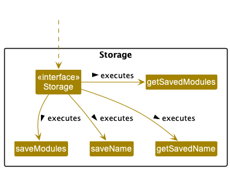
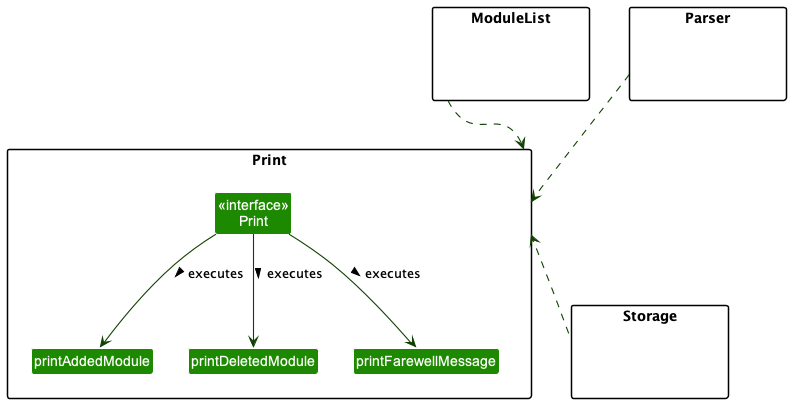
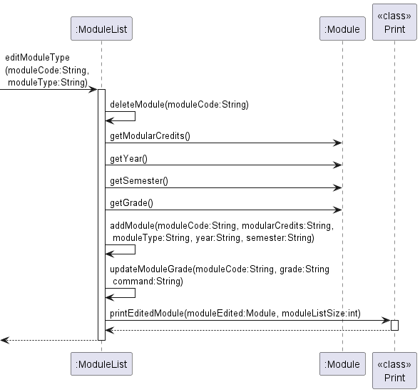
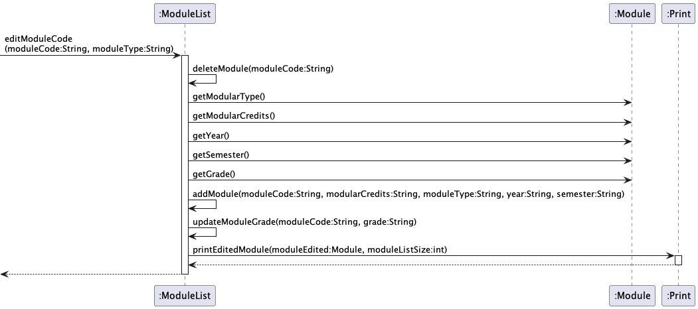

# Modganiser Developer Guide

## Introduction

---

Modganiser is **effortless module planning, at your fingertips via the Command Line Interface** (CLI). It helps Information security students graduate in time by giving you a platform to plan all 4 years of your modules to ensure that you meet graduation requirements (UE/GEs).  If you can type fast, Modganiser can get your schedule up  faster than traditional GUI apps.

## Table of Contents

---

[Introduction](#introduction)

[Table of contents](#table-of-contents) 
0. [Acknowledgements](#acknowledgements)
1. [Setting Up](#setting-up)
2. [Architecture](#architecture)
   + 2.1. [Storage](#1-storage-component)
   + 2.2. [Parser](#2-parser-component)
   + 2.3. [ModuleList](#3-modulelist-component)
   + 2.4. [Print](#4-print-component)
   + 2.5. [Module](#5-module-component)
3. [Design and Implementation](#3-design-and-implementation)
   + 3.1. [ManPage](#31-manpage)
   + 3.2. [Parser](#32-parser)
   + 3.3. [Add Modules](#33-add-modules)
   + 3.4. [Find Modules](#34-find-modules)
   + 3.5. [Delete Modules](#35-delete-modules)
   + 3.6. [Edit Modules](#36-edit-modules)
   + 3.7. [Add or Update Grade](#37-add-or-update-grade)
   + 3.8. [Calculate CAP](#38-calculate-cap)
4. [Appendix: Requirements](#appendix--requirements)
   + 4.1. [Product Scope](#product-scope)
   + 4.2. [Target User Profile](#target-user-profile)
   + 4.3. [User Stories](#user-stories)
   + 4.4. [Non-Functional Requirements](#non-functional-requirements)
   + 4.5. [Glossary](#glossary)
5. [Appendix: Instructions for manual testing](#appendix--instructions-for-manual-testing)

## Introduction 

## Acknowledgements

{list here sources of all reused/adapted ideas, code, documentation, and third-party libraries -- include links to the original source as well}

## Setting Up

## Architecture

---

The Diagram below shows an overview of how components are linked together to produce Modganiser.

**Main components of the architecture**

Modganiser has a class called `Duke`.

* It starts the app up at the beginning and passes the relevant inputs to the `Parser` to be parsed.
* It saves the name of the user for future uses.
* It ends the program when called to.

Modganiser consists of :

1. `Storage`
2. `Parser`
3. `ModuleList`
4. `Print`
5. `Module`

**How the components interact with each other**

When using the command `add /CS2113T /4 /CORE /1 /1` ,
The Sequence Diagram shows how the components interact with each other:

{image}

### 1. **Storage Component**
The main job of this component is to ensure the proper storage of details regarding the modules in the user's plans and 
the user's name. The `Storage` component will be called immediately when Modganiser starts up to read the previously 
saved data and also called whenever the user enters a command which modifies the details of modules in 
their plan.

The `Storage` component,
* can save the name of the user into a text file.
* is able to save changes to a text file after each change made by the user, such as an addition or deletion of 
modules
* can read saved data from the text file back into corresponding objects

### 2. **Parser Component**

Firstly, the {explain workflow}

{uses}
* It calls the relevant methods according to the user input

### 3. **ModuleList Component**

Firstly, when the ModuleList is called, it will execute one of the 7 types of methods.

The 7 types of methods are:
1. AddModule
2. EditModule
3. DeleteModule
4. FindModule
5. ListModule
6. CalculateCap
7. TrackModule

The ListOfModules is the ArrayList containing Module objects up to the current point of execution.

For the first 2 methods, it will interact with the Module component. The result will then update the ListOfModules.

The remaining methods will interact with the ListOfModules directly.

ListOfModules will then interact with the Print component to display the results of the executed command to the user.

ModuleList component will also interact with Storage component to save the updated ListofModules.

{uses}
*

### 4. **Print Component**

When the `Print` component is called, it helps to print messages to the User Interface (UI) to allow for interaction with the user. 

The `Print` component,
* contains many methods where each method represents a single type of response to a specific type of user input.
* executes the relevant method to print a message when called in other components.

> ❗ **Note**
>
> Only some methods of `Print` are listed in the diagram above with many others omitted due to limited space.

### 5. **Module Component**

Firstly, the {explain workflow}

{uses}
*

## 3. Design and Implementation

---

### 3.1. ManPage 

The ManPage is a class that is used to display parts of the manual page that is requested by the user.
It has multiple methods for separate features.

**Implementation**

The sequence by which the ManPage class handles the `man` command is as follows:
1) The `Parser` class extracts the other fields of the user input, and calls upon the `checkUserInput()` method
   which calls upon the `checkManPageInput()`.

2) The method then uses the methods in the ManPage class to print out the requested feature.

`ManPage#printManPage()` - Prints the Command Summary.

`ManPage#printManPageAdd()` - Prints description of how to use the add feature.

`ManPage#printManPageList()` - Prints description of how to use the list feature.

`ManPage#printManPageEdit()` - Prints description of how to use the edit feature.

`ManPage#printManPageFind()` - Prints description of how to use the find feature.

`ManPage#printManPageDelete()` - Prints description of how to use the delete feature.

`ManPage#printManPageCalculator()` - Prints description of how to use the grade calculator.

`ManPage#printManPageUpdateGrade()` - Prints description of how to input grades.

`ManPage#printManPageExit()` - Prints description of how to use the exit feature.

**Design Considerations**

**Alternative 1** : Prints the manual page individually as features. 
Pros: Avoids wordy and long manual page when command is man, ability to have more description
for specific features. Avoids long methods. 
Cons: Extra step of typing another command to understand a feature well.

**Alternative 2**: Combining all feature descriptions in a single manual page. 
Pros: Avoid extra step of typing another command to understand a feature well.
Cons: Wordy and long manual page when command is man, user has to scroll through
a long manual page to find what they need. Long method.

### 3.2. Parser

The `Parser` is a class that handles the commands keyed in by the user.  
It has multiple checks to ensure that the user keys in valid commands. 

<!---elaborate more on the class, still unsure of the format...--->
<!---insert other commands here, still unsure of the format...(should it all be under Parser class or separate?)--->

### 3.3. Add Modules

`add` command:

The `add` command is used by the user to add a module or multiple modules at once.

The sequence by which the Parser class handles the `add` command is as follows:
1) The `Parser` class extracts the necessary fields from the user input, and calls upon the `addModule`
   method in the `ModuleList` class in a loop.
2) The method then checks the type of module that is being added, then calls the relevant
   constructor (`Core`, `UE`, `GE`, `Internship`).
3) The `addModule` method returns the module that is added to the `Parser` class.
4) The `getModuleListSize` method is called from `ModuleList` class.
5) The `printAddedModule` method is called from the `Print` class to display the result to the user.

The sequence of events above can be represented with the following sequence diagram:

<small><i>Figure ???</i></small>

### 3.4. Find Modules

The find modules features is facilitated by the `Parser`, `ModuleList` and `Module` Classes. `Parser` helps to check
for user input to determine is user doing a search via a module name or module type, which will then invoke the 
`findModuleByName` and `findModuleByType` methods respectively. If any modules are found, the ChatBot will print out
all the modules, else the ChatBot will return a message to the user, saying that no modules were found with the search
term they used.

Given below is an example usage scenario and how the findModuleByName mechanism behaves at each step.

Step 1: The user launches the application for the first time. The ChatBot will be initialised with an empty ArrayList
of Modules.

Step 2: The user executes `add /CS2113T CS2101 /4 /CORE /2 /2` to add two modules into the ChatBot via the addModules 
feature

The following object diagram shows the current state of the ChatBot:

<small><i>Figure ???</i></small>

Step 3: The user now wants to find the details of the modules he has just added. He executes `find /name /CS` which
will call `findModuleByName`. This method will then print out all the modules that have the keyword "CS" in their
module name.

The following sequence diagram shows how the `findModuleByName` operation works:

<small><i>Figure ???</i></small>

### 3.5. Delete Modules

`delete` command:

The `delete` command is used by the user to delete a module which is specified by the user.

The sequence in which the `Parser` class handles the `delete` command is as follows:
1) The `Parser` class extracts the necessary fields from the user input, and calls upon the `deleteModule`
   method in the `ModuleList` class.
2) The method then loops through the moduleList array, attempting to find a module with the module code
   that was specified by the user.
3) If a corresponding module is found, the `deleteModule` method will remove the module from the moduleList array
   and return the deleted `Module` object. Otherwise, the `deleteModule` method returns `null`.
4) If a deleted `Module` object is returned from `deleteModule`, the `Parser` class calls upon
   `printDeletedModule()` of the `Print` class. Otherwise, the `Parser` class calls upon `printNoDeletedModuleFound()`
   of the `Print` class. This displays to the user the result of the `delete` command.

The following sequence diagram shows how the `deleteModule` operation works:

### 3.6. Edit Modules

`edit` command:

The `edit` command is used by the user to make changes to fields in the module description.

The sequence in which the `Parser` class handles the `edit` command is as follows:
1) The `Parser` class extracts the other fields of the user input, and calls upon the `editModuleField()` method
   by self-invocation.
2) The method then uses a `switch` statement to evaluate the module field that the user wants to update.
3) After checking the field to be updated, the appropriate method within the `ModuleList` class is called upon to
   make the changes specified by the user.
4) If the user wants to update Modular Credits, the `editModularCredits()` method is called.
   This method directly modifies the `modularCredits` attribute of the `Module` object.
5) If the user wants to update the Year, the `editYear()` method is called.
   This method directly modifies the `year` attribute of the `Module` object.
6) If the user wants to update the Semester, the `editSemester()` method is called.
   This method directly modifies the `semester` attribute of the `Module` object.
7) If the user wants to update the grade, the `editModuleGrade` method is called.
   This method calls the `updateModuleGrade` method which directly modifies the `grade` attribute of the `Module` 
   object. 
8) If the user wants to update Module Type, the `editModuleType()` method is called.
   This method removes the existing `Module` object and adds a new `Module` object of the new type specified
   by the user. The `getModularCredits()`, `getYear()`, `getSemester()` and `getGrade()`
   methods in the `Module` class are also called upon to obtain the respective fields required to create the new
   `Module` object.
9) If the user wants to update Module Code, the `editModuleCode()` method is called.
   This method removes the existing `Module` object and adds a new `Module` object with the new module code specified
   by the user. The `getModuleType()`, `getModularCredits()`, `getYear()`, `getSemester()` and `getGrade()`
   methods in the `Module` class are also called upon to obtain the respective fields required to create the new
   `Module` object.

The following sequence diagram shows how the `editModuleField` operation works:

> ❗ **Note**
>
> Some method calls from ModuleList are intentionally left out of the diagram to keep it simple.

The following sequence diagram shows more details on how the `editModuleType` operation works:

The following sequence diagram shows more details on how the `editModuleCode` operation works:

### 3.7. Add or Update Grade

`grade` command:

The `grade` command is used by the user to update the grade of modules that have already been completed.

The sequence by which the Parser class handles the `grade` command is as follows:
1) The `Parser` class extracts the other fields of the user input, and calls upon the `updateModuleGrade()` method
   in the `ModuleList` class.
2) The method then loops through the moduleList array to find the moduleCode that requires a grade update.
3) If the module is found, it calls the `Module` object method `setGrade()` to update the grade field
   and prints a success message by calling the `printUpdatedModuleGrade()` method of the `Print` class.
4) Else, it prints an error message by calling the `printInvalidModule()` method of the `Print` class.

The sequence of events above can be represented with the following sequence diagram:

<small><i>Figure ???</i></small>

### 3.8. Calculate CAP

`calculateCAP` command:

The `calculateCAP` command is used by the user to calculate the Cumulative Average Point (CAP) of graded modules.

The sequence by which the Parser class handles the `calculateCAP` command is as follows:
1) The `Parser` class extracts the other fields of the user input, and calls upon the `calculateCAP()` method
   in the `ModuleList` class.
2) The method then loops through the moduleList array to find modules that have been graded.
3) It checks if the module grade should be counted by self-invocation of the `shouldCountModule()` method
4) If it is, proceeds to obtain the grade value by self-invocation of the `getGradeValue()` method.
5) Calculates the required grade values, and finally calls the `printCalculatedCAP()` of the `Print` class to display
   the result to the user

The sequence of events above can be represented with the following sequence diagram:

<small><i>Figure ???</i></small>

---

## Appendix: Requirements

###  Product Scope

**Target User Profile**

+ Information Security students in NUS
+ Has a need to organise and manage their modules
+ Can type fast
+ Prefers typing to mouse interactions

**Value Proposition**

Better organisation of modules across 4 years in NUS, where planning can be done in a more convenient manner compared to 
using typical applications

### User Stories

| Priority | As a...      | I want to...                                    | So that I can...                                                               |
|----------|--------------|-------------------------------------------------|--------------------------------------------------------------------------------|
| High     | New user     | See usage instructions                          | Refer to them when I forget the commands                                       |
| High     | Current user | Add modules                                     | To plan out my 4 years in uni                                                  |
| High     | Current user | Delete modules                                  | To edit my plan when necessary                                                 |
| High     | Current user | Edit the details of current modules             | Change the details should I made a mistake or there was an update from NUS     |
| High     | Current user | View all my modules                             | Visualise my 4 year plan                                                       |
| High     | Current user | View my modules by year                         | Focus better on one year rather than all 4 years                               |
| Medium   | Current user | Track my modules by type                        | Have an overview of my completion status of all types of modules               |
| Medium   | Current user | Track the completion status of each module type | Ensure that the MC requirements of each type of module is met                  |
| Medium   | Current user | Update the grade I got for a module             | Keep track of my grades                                                        |
| Medium   | Current user | Calculate my CAP                                | Know my current CAP and project what honours I’ll graduate with                |
| Medium   | New user     | See usage instructions based on feature         | Get more in depth knowledge on the feature that I require                      |
| Medium   | Current user | Find a module by its code                       | Locate the module code without having to go through the entire list of modules |
| Medium   | Current user | Find a module by its type                       | Locate all modules in a category without having to go through the entire list  |
| Low      | Current user | Sort a module by its module code                | Find similarly coded modules easily                                            |

### Use Cases

For all use cases below, the **System** is `Modganiser` and the **Actor** is the `user`

**Use case: Edit a module's year**

**Main Success Scenario (MSS):**
1. User requests to list all modules
2. Modganiser shows the list of modules in the plan
3. User requests to edit the year of a specific module
4. Modganiser edits the year of the specific module and displays the details of the updated module

**Extensions:**
+ 2a. The list of modules is empty.
  + 2a1. Modganiser displays a relevant error message.

    Use case ends.

+ 3a. The specified module does not exist.
  + 3a1. Modganiser displays a relevant error message.
  
    Use case resumes at step 2.

+ 3b. The newly specified year is invalid.
   + 3b1. Modganiser displays a relevant error message.

     Use case resumes at step 2.

**Use case: Delete a module**

**Main Success Scenario (MSS):**
1. User requests to list all modules
2. Modganiser shows the list of modules in the plan
3. User requests to delete a specific module in the list
4. Modganiser deletes the specific module and displays the details of the deleted module

**Extensions:**
+ 2a. The list of modules is empty.
   + 2a1. Modganiser displays a relevant error message.

     Use case ends.

+ 3a. The specified module does not exist.
   + 3a1. Modganiser displays an error message.

     Use case resumes at step 2.

### Non-Functional Requirements

1. Should work on any mainstream OS as long as it has Java 11 or above installed
2. Should be able to hold up to 1000 modules without a noticeable sluggishness in performance for typical usage.
3. A user should be clear about the required inputs without any confusion about the commands.
4. A user should easily understand the visual feedback displayed to them in response to their commands.
5. A user should find the required inputs intuitive such that they do not need to constantly refer to the manual page
   for help
6. A user with above average typing speed for regular English text (i.e. not code, not system admin commands) should be 
   able to accomplish most of the tasks faster using commands than using the mouse.

### Glossary

Mainstream OS: Windows, Linux, Unix, OS-X, MacOS

---

## Appendix: Instructions for manual testing

Below are some instructions to test the application manually.

> ❗ **Note**
>
> The following instructions merely serve as a reference by providing a starting point for testers to work on. Testers 
> are expected to do more exploratory testing by themselves.

### Launch and shutdown

1. Initial launch
   1. Download the jar file and move it into an empty folder
   2. Using terminal or command prompt, navigate to the folder containing the jar file
   3. Enter the command `java -jar tp.jar`
   
      Expected: Shows the welcome message and prompts the user for his/her name.

2. Quitting the application
   1. Quit the application using the command `bye`
      
      Expected: Shows the goodbye message and the application is shut down 

### Adding a module 

1. Adding a module when there are no modules in the list
   1. Test case: `add /CS1010 /4 /CORE /1 /1`
      
      Expected: Module is successfully added to the list and a success message displayed. The number of modules
      in the list should be 1 at this point.

   2. Test case: `add /CS1010 /4 /EASY /1 /1`

      Expected: Module is not added to the list. An error message is displayed along with the error details being shown 
      in the message.

   3. Other incorrect add commands to try: `add`, `add CS1010 /4 /CORE /1 /1`, `add /CS1010 /20 /CORE /1 /1`,
   `add /CS1010 /4 /CORE /x /y` (where x is > 4 or < 1 and y is not 1, 1.5, 2, or 2.5)

      Expected: Similar to previous erroneous case.
   

2. Adding a module when there are modules in the list
   1. Test case: `add /CS2106 /4 /CORE /2 /1`

      Expected: Module is successfully added to the list and a success message is displayed. The number of modules
      in the list should increase by 1.

   2. Other incorrect add commands to try: `add`, `add CS1010 /4 /CORE /1 /1`, `add /CS1010 /20 /CORE /1 /1`,
      `add /CS1010 /4 /CORE /x /y` (where x is > 4 or < 1 and y is not 1, 1.5, 2, or 2.5)

      Expected: Similar to previous erroneous cases.

### Deleting a module

1. Deleting a module when there are no modules in the list
   1. Test case: `delete /CS2105`

      Expected: No module is deleted. An error message is displayed along with the error details being shown
      in the message.

2. Deleting a module when there are modules in the list
   1. Test case: `delete /CS1010`

      Expected: Module is successfully deleted and a success message is displayed. The number of modules
      in the list should decrease by 1.

   2. Other incorrect add commands to try: `delete`, `delete CS1010`, `delete CORE`,

      Expected: No module is deleted. An error message is displayed along with the error details being shown
      in the message.

3. Deleting a module which does not exist in the list
   1. Ensure that the module CS2107 is not in your list currently
   2. Test case: `delete /CS2107`

      Expected: No module is deleted. An error message is displayed along with the error details being shown
      in the message.

### Saving Data

1. Dealing with missing data files
   1. Go to the folder containing the jar file which you have downloaded 
   2. In the same folder, find the "data" folder and navigate to it
   3. Find the "modules.txt" and "name.txt" files and delete both of them
   4. Launch the application as per normal
   
      Expected: Shows the welcome message and prompts the user for his/her name. `list /all` command shows that the
      list of modules is now empty.

