 

# Modganiser Developer Guide

---

## Introduction

Modganiser is a platform that provides **effortless module planning, at your fingertips via the Command Line Interface** (CLI). It helps Information security students graduate in time by giving you a platform to plan all 4 years of your modules to ensure that you meet graduation requirements (UE/GEs).  If you can type fast, Modganiser can get your schedule up  faster than traditional GUI apps.

---

## Table of Contents

1. [Acknowledgements](#1-acknowledgements)
2. [Setting Up](#2-setting-up)
3. [Architecture](#3-architecture)
   + 3.1 [Storage](#31-storage-component)
   + 3.2 [Parser](#32-parser-component)
   + 3.3 [ModuleList](#33-modulelist-component)
   + 3.4 [Print](#34-print-component)
   + 3.5 [Module](#35-module-component)
4. [Design and Implementation](#4-design-and-implementation)
   + 4.1 [ManPage](#41-manpage)
   + 4.2 [Add Modules](#42-add-modules)
   + 4.3 [Find Modules](#43-find-modules)
   + 4.4 [Delete Modules](#44-delete-modules)
   + 4.5 [Edit Modules](#45-edit-modules)
   + 4.6 [List Modules](#46-list-modules)
   + 4.7 [Track Modules](#47-track-modules)
   + 4.8 [Add Grade](#48-add-grade)
   + 4.9 [Calculate CAP](#49-calculate-cap)
5. [Documentation, Logging and Testing](#5-documentation-logging-and-testing)
   + 5.1 [Documentation](#51-documentation)
   + 5.2 [Logging](#52-logging)
   + 5.3 [Testing](#53-testing)
6. [Appendix: Requirements](#6-appendix-requirements)
   + 6.1 [Product Scope](#61-product-scope)
   + 6.2 [User Stories](#62-user-stories)
   + 6.3 [Use Cases](#63-use-cases)
   + 6.4 [Non-Functional Requirements](#64-non-functional-requirements)
   + 6.5 [Glossary](#65-glossary)
7. [Appendix: Instructions for Manual Testing](#7-appendix-instructions-for-manual-testing)

---

## 1. Acknowledgements

* style.puml was used in making some of these diagrams. It was reused from the AB3 developers guide provided to us.
* [Link to AB3 developer guide](https://se-education.org/addressbook-level3/DeveloperGuide.html#logic-component).
* [Link to original source code](https://github.com/se-edu/addressbook-level3/blob/master/docs/diagrams/style.puml).

---

## 2. Setting Up

> ❗ **Warning** : Follow the steps in the following guide precisely. Things will not work out if you deviate in some steps. 

First, fork [Modganiser's repo](https://github.com/AY2223S2-CS2113T-T09-4/tp), and clone the fork into your computer.

**If you plan to use Intellij IDEA (highly recommended):**

1. [Configure the JDK](https://se-education.org/guides/tutorials/intellijJdk.html) 
to ensure Intellij IDEA is configured to use JDK 11.

2. [Import the project as a Gradle project into Intellij IDEA.](https://se-education.org/guides/tutorials/intellijImportGradleProject.html)
   
   > 📓 **Note** : Importing a Gradle project is slightly different from importing a normal Java project.

3. Verify the setup:
   Run the seedu.main.Main and try a few commands.
   Run the tests to ensure they all pass.

### Before writing code

1. **Configure coding style**

   If using Intellij IDEA:
   [Configure the code style](https://se-education.org/guides/tutorials/intellijCodeStyle.html) to set up Intellij IDEA’s coding style to match ours :
 
   
   > 💡 **Tip** : Optionally, you can [follow the guide](https://se-education.org/guides/tutorials/checkstyle.html)
   > to find out how to use the CheckStyle within Intellij IDEA (e.g., to report problems as you write code)

2. **Set up CI**
   
   This project comes with a GitHub Actions config files (in .github/workflows folder). When GitHub detects those files,
   it will run the CI for your project automatically at each push to the master branch or to any PR. No set up required.
   

3. **Learn the design**
   
   When you are ready to start coding, we recommend that you get some sense of the overall design by 
   reading about Modganiser's architecture.

**Returning back to Table of Contents: [Table of contents](#table-of-contents)**

---

## 3. Architecture

The Diagram below shows an overview of how components are linked together to produce Modganiser.

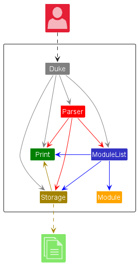

Main components of the architecture
Modganiser has a class called `Main`.

* It starts the app up at the beginning and passes the relevant inputs to the `Parser` to be parsed.
* It saves the name of the user for future uses.
* It ends the program when called to.

Modganiser consists of :

1. `Storage` : Reads data from, and writes data to, the hard disk.
2. `Parser` : Executes User's input.
3. `ModuleList` : Stores the modules.
4. `Print` : Displays the outcome.
5. `Module` : Creates the module and its attributes.

**How the components interact with each other**

When using the command `add /CS2113T /4 /CORE /1 /1` ,
The Sequence Diagram shows how the components interact with each other:

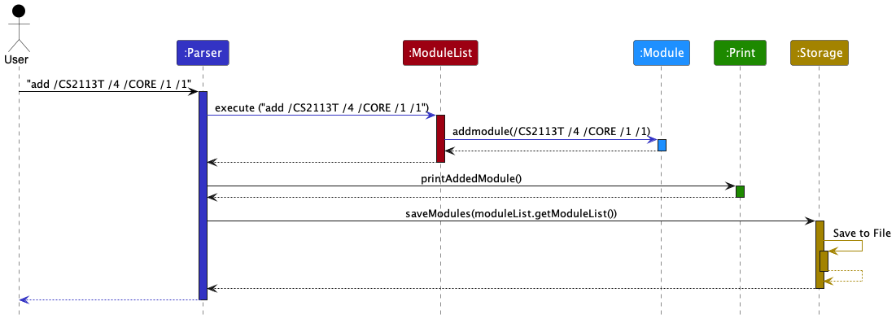

The sections below give more details of each component.

**Returning back to Table of Contents: [Table of contents](#table-of-contents)**

---

### 3.1 **Storage Component**
The main job of this component is to ensure the proper storage of details regarding the modules in the user's plans and 
the user's name. It is made up of the `Storage` class which is immediately utilised when Modganiser starts up to read the previously 
saved data. Furthermore, this component plays a key role whenever the user enters a command which modifies the details of modules in 
their plan.

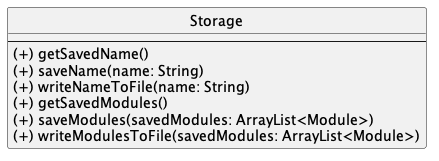

The `Storage` class,
* can save the name of the user into a text file.
* is able to save changes to a text file after each change made by the user, such as an addition or deletion of 
modules
* can read saved data from the text file back into corresponding objects

**Returning back to Table of Contents: [Table of contents](#table-of-contents)**

---

### 3.2 **Parser Component**
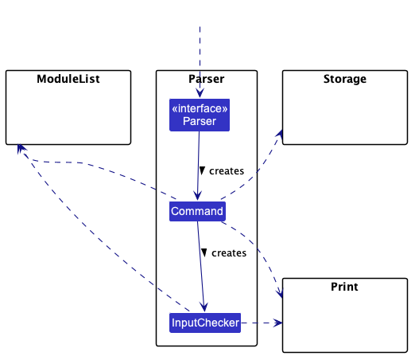

How the `Parser` component works:

* Firstly, when the `Parser` is called upon, it uses the `Command` class to parse the user command.
* This results in the creation of a `Command` object which is then executed to parse the user command.
* When the `Command` object is called upon, it uses the `InputChecker` class to check the user command for valid inputs. 
* This results in the creation of a `InputChecker` object which is then executed to check the user command to ensure its 
validity.
* After the input validation, the appropriate methods in the `Command` class are executed according to the user command.
* The `Command` class interacts with the `ModuleList` component to fulfil the requirements of the user command.
* The `Command` class also interacts with the `Storage` component to save the updated list of modules after calling upon
  methods in the `ModuleList` component.
* The `InputChecker` class also interacts with the `ModuleList` component for the checking of user input.
* Both the `Command` and `InputChecker` classes interact with the `Print` component for the printing of messages 
to the user.

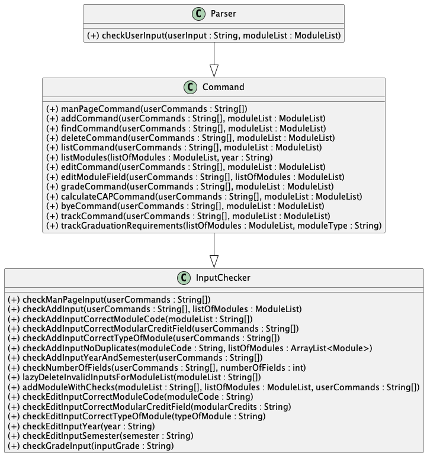

**Returning back to Table of Contents: [Table of contents](#table-of-contents)**

---

### 3.3 **ModuleList Component**

The ModuleList component serves to store the arraylist of modules as well as methods to support the commands of the user. 
The ModuleList component is made up of the ModuleList class.

How the `ModuleList` component works:
* ModuleList will have methods that support the user's commands other than man. (Example: Add, Delete, Edit, Find, Etc.)

* The `listOfModules` is the ArrayList containing `Module` objects up to the current point of execution.

* Before the command is passed to the ModuleList component, it should have been parsed and checked.

* Some methods such as Add and Edit will interact with the `Module` component. The result will then be used to update the
  `listOfModules`.

* The remaining methods will interact with the `listOfModules` directly.

* `listOfModules` will then interact with the `Print` component to display the results of the executed command to the
  user.

* The `ModuleList` component will also interact with `Storage` component to save the updated `listOfModules`.

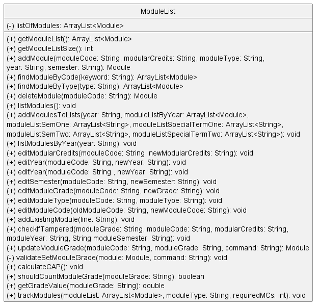

**Returning back to Table of Contents: [Table of contents](#table-of-contents)**

---

### 3.4 **Print Component**

When the `Print` component is called, it helps to print messages to the User Interface (UI) to allow for interaction with the user. 

The `Print` component,
* contains many methods where each method represents a single type of response to a specific type of user input.
* executes the relevant method to print a message when called in other components.

**Returning back to Table of Contents: [Table of contents](#table-of-contents)**

---

### 3.5 **Module Component**

When the `Module` is called, it will execute to set and get its attributes.
Mostly used for the `Storage` component and the `ModuleList` component that works
more with the `Module` component to create, update and retrieve any of the 5 attributes.

`Module` is a component that has these attributes:

1. moduleCode
2. modularCredits
3. year
4. semester
5. grade

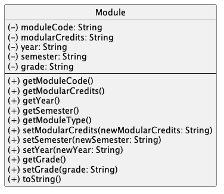

**Returning back to Table of Contents: [Table of contents](#table-of-contents)**

---

## 4. Design and Implementation

---

### 4.1 ManPage 

The `ManPage` is a class that is used to display parts of the manual page that is requested by the user.
It has multiple methods for separate features.

**Implementation**

The sequence by which the `ManPage` class handles the `man` command is as follows:

1. The `Parser` class extracts the other fields of the user input, and calls upon the `checkUserInput()` method
   which calls upon the `checkManPageInput()`.
2. The method then uses the methods in the `ManPage` class to print out the requested feature.

**Some Examples of the methods in the `ManPage` class:**

`ManPage#printManPage()` - Prints the Command Summary.

`ManPage#printManPageAdd()` - Prints description of how to use the add feature.

`ManPage#printManPageList()` - Prints description of how to use the list feature.

`ManPage#printManPageCalculator()` - Prints description of how to use the grade calculator.

`ManPage#printManPageUpdateGrade()` - Prints description of how to input grades.

**Design Considerations**

**Alternative 1** : Prints the manual page individually as features.
* Pros: Avoids wordy and long manual page when command is man, ability to have more description
for specific features. Avoids long methods.
* Cons: Extra step of typing another command to understand a feature well.

**Alternative 2**: Combining all feature descriptions in a single manual page.
* Pros: Avoid extra step of typing another command to understand a feature well.
* Cons: Wordy and long manual page when command is man, user has to scroll through
a long manual page to find what they need. Long method.

**Returning back to Table of Contents: [Table of contents](#table-of-contents)**

---

### 4.2 Add Modules

`add` command:

The `add` command is used by the user to add a module or multiple modules at once.

The sequence by which the `Command` class handles the `add` command is as follows:

1. The `Command` class extracts the necessary fields from the user input, and calls upon the `checkAddInput()`
   method in the `InputChecker` class.
2. Subsequently, `addModuleWithChecks()` is called by self-invocation.
3. This method first validates the inputs from the user then proceeds to call the `addModule()` method of the `ModuleList`
   class.
4. The respective module(s) are added to the `listOfModules` attribute in `ModuleList` as requested by the user.
5. The `addModule()` method returns the module that is added to the `listOfModules`.
6. Finally, the `printAddedModule()` method is called from the `Print` class to display the result to the user.

The sequence of events above can be represented with the following sequence diagram:

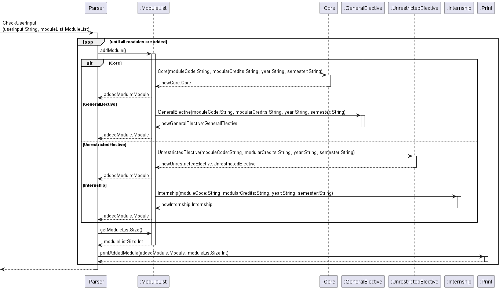

**Returning back to Table of Contents: [Table of contents](#table-of-contents)**

---

### 4.3 Find Modules

The find modules features is facilitated by the `Command`, `ModuleList` and `Module` Classes. `Command` helps to check
for user input to determine is user doing a search via a module name or module type, which will then invoke the 
`findModuleByCode()` and `findModuleByType()` methods respectively. If any modules are found, Modganiser will print out
all the modules, else Modganiser will return a message to the user, saying that no modules were found with the search
term they used.

Given below is an example usage scenario and how the `findModuleByCode()` mechanism behaves at each step.

1. The user launches the application for the first time. Modganiser will be initialised with an empty ArrayList
of Modules.

2. The user executes `add /CS2113T CS2101 /4 /CORE /2 /2` to add two modules into Modganiser via the add modules 
feature
The following object diagram shows the current state of Modganiser:

   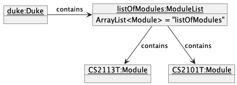
3. The user now wants to find the details of the modules he has just added. He executes `find /code /CS` which
will call `findModuleByCode()`. This method will then print out all the modules that have the keyword "CS" in their
module name, which in this case will print CS2113T and CS2101 along with their respective details.

The following sequence diagram shows how the `findModuleByCode()` operation works:

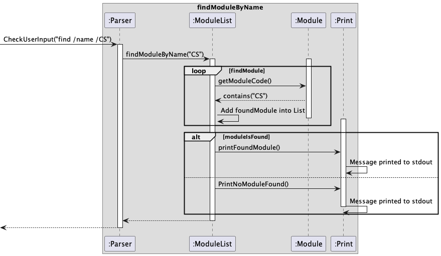

For `findModuleByType()` method, it works similarly to `findModuleByCode()`. The differences are listed below
1. The search terms can only be CORE, GE, UE or Internship.
2. Instead of `getModuleCode()`, `ModuleList` will check which modules in the arraylist are an instance of the module type that is being searched.

**Design Considerations**

**Alternative 1:** Find module by code will only return the module if the search term is exactly the same as the module code
* Pros: This makes the search module by code easy to implement  
* Cons: This makes the search function very restrictive, and users might be looking to search for all modules which are CS-coded rather than a specific module

**Returning back to Table of Contents: [Table of contents](#table-of-contents)**

---

### 4.4 Delete Modules

`delete` command:

The `delete` command is used by the user to delete a module which is specified by the user.

The sequence in which the `Command` class handles the `delete` command is as follows:
1. The `Command` class extracts the necessary fields from the user input, and calls upon the `deleteModule()`
   method in the `ModuleList` class.
2. The method then loops through the `listOfModules` array in the `ModuleList` object, attempting to find a module 
   with the module code that was specified by the user.
3. If a corresponding module is found, the `deleteModule()` method will remove the module from the `listOfModules` array
   and return the deleted `Module` object. Otherwise, the `deleteModule()` method returns `null`.
4. If a deleted `Module` object is returned from `deleteModule()`, the `Command` class calls upon
   `printDeletedModule()` of the `Print` class. Otherwise, the `Command` class calls upon `printNoDeletedModuleFound()`
   of the `Print` class. This displays to the user the result of the `delete` command.

The following sequence diagram shows how the `deleteCommand()` operation works:

**Returning back to Table of Contents: [Table of contents](#table-of-contents)**

---

### 4.5 Edit Modules

`edit` command:

The following sequence diagram shows how the `editCommand()` operation works:

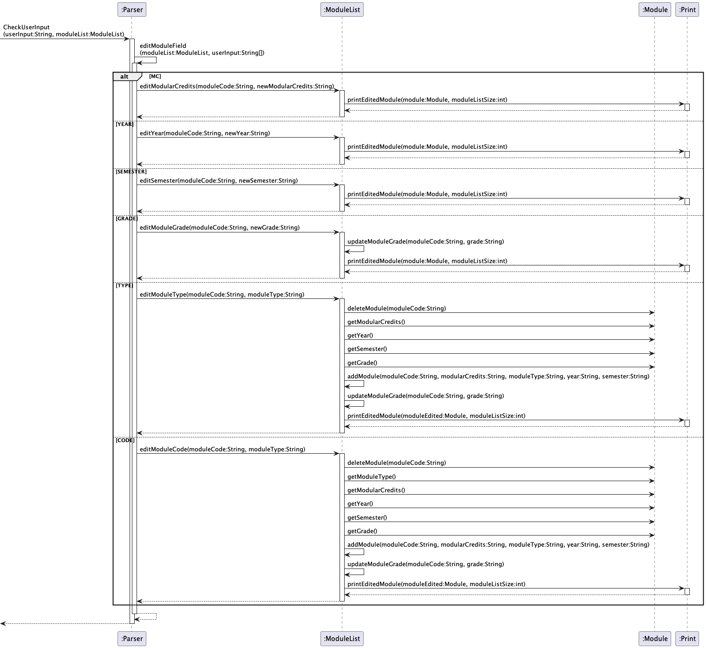

> 📓 **Note**
>
> Some method calls from ModuleList are intentionally left out of the diagram to keep it simple.
The `edit` command is used by the user to make changes to fields in the module description.

The sequence in which the `Command` class handles the `edit` command is as follows:
1. The `Command` class extracts the other fields of the user input, and calls upon the `editModuleField()` method
   by self-invocation.
2. The method then uses a `switch` statement to evaluate the module field that the user wants to update.
3. After checking the field to be updated, the appropriate method within the `ModuleList` class is called upon to
   make the changes specified by the user.
4. If the user wants to update Modular Credits, the `editModularCredits()` method is called.
   This method directly modifies the `modularCredits` attribute of the `Module` object.
5. If the user wants to update the Year, the `editYear()` method is called.
   This method directly modifies the `year` attribute of the `Module` object.
6. If the user wants to update the Semester, the `editSemester()` method is called.
   This method directly modifies the `semester` attribute of the `Module` object.
7. If the user wants to update the grade, the `editModuleGrade()` method is called.
   This method calls the `updateModuleGrade()` method which directly modifies the `grade` attribute of the `Module` 
   object. (Not shown in sequence diagram)
8. If the user wants to update Module Type, the `editModuleType()` method is called.
   More information regarding this method is provided in the subsequent section.
9. If the user wants to update Module Code, the `editModuleCode()` method is called.
   More information regarding this method is provided in the subsequent section.

---

The following sequence diagram shows more details on how the `editModuleType()` operation works:

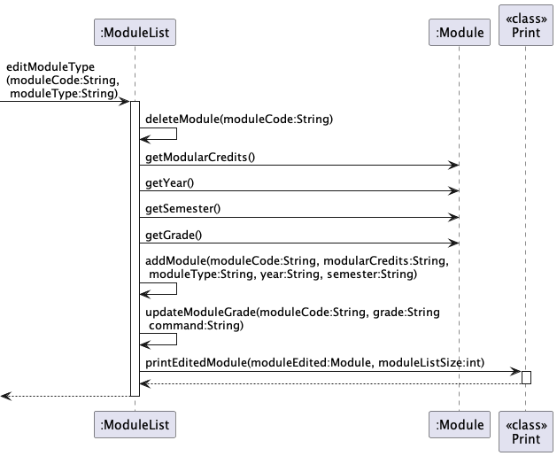

The `editModuleType()` method removes the existing `Module` object and adds a new `Module` object of the new type specified
by the user. The `getModularCredits()`, `getYear()`, `getSemester()` and `getGrade()`
methods in the `Module` class are also called upon to obtain the respective required fields to create the new
`Module` object.

---

The following sequence diagram shows more details on how the `editModuleCode` operation works:

The `editModuleCode()` method removes the existing `Module` object and adds a new `Module` object with the new module code specified
by the user. The `getModuleType()`, `getModularCredits()`, `getYear()`, `getSemester()` and `getGrade()`
methods in the `Module` class are also called upon to obtain the respective fields required to create the new
`Module` object.

**Returning back to Table of Contents: [Table of contents](#table-of-contents)**

---

### 4.6 List Modules

`list` command:

> 📓 **Note**
>
> The full sequence diagram for the `list` command has been intentionally left out here to keep it simpler.
The `list` command is used by the user to view the modules that are planned for a specific year. 

The sequence in which the `Command` class handles the `list` command is as follows:
1. The `Command` class extracts the other fields of the user input, and calls upon the `listModules()` method
   by self-invocation.
2. The method then uses a `switch` statement to evaluate the year that the user wants to view. The accepted inputs for
the `year` field are `1`, `2`, `3`, `4` and `ALL` which represents all 4 years.
3. After checking the year, the `listModulesByYear()` method within the `ModuleList` class is called upon to
   list the modules that are planned for the year specified by the user.
4. The `listModulesByYear()` method calls upon the `addModulesToLists()` method in the `ModuleList` class in order to
retrieve the list of modules planned for each semester in the specified year.
5. The `addModulesToLists()` method calls upon the `getModuleType()`, `getGrade()`, `getModuleCode()`, 
`getModularCredits()`, `getYear()` and `getSemester()` methods within the `Module` class to get the attributes of each 
module in the list of modules.
6. The `listModulesByYear()` method also calls upon the `printModuleListByYear()` method within the `Print` class to 
print out the list of modules to the user. If there are no modules planned for the specified year, it calls upon the 
`printEmptyModuleList()` method within the `Print` class instead, to print out an error message to the user.

The following sequence diagram shows more details on how the `listModulesByYear()` operation works:

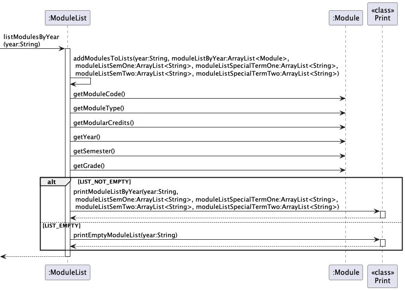

In the case where the `year` input by the user is either `1`, `2`, `3` or `4`, the `listModulesByYear` method is called 
once to list the modules in the specified `year`. In the case where the `year` input is `ALL`, the `listModulesByYear` 
method is called for a total of 4 times to list the modules in the years 1 to 4 , respectively. 

**Returning back to Table of Contents: [Table of contents](#table-of-contents)**

---

### 4.7 Track Modules

`track` command:

The sequence in which the `Command` class handles the `track` command is as follows:
1. The `trackCommand()` method runs checks on the user input to ensure it is valid before calling upon the 
`trackGraduationRequirements()` method by self-invocation which checks how far the user is from meeting the 
requirements for a specific module type.
2. The `trackGraduationRequirements()` method uses a `switch` statement to evaluate which module type the user wants to 
view the requirements for. The accepted inputs for the `moduleType` field are `CORE`, `UE`, `GE`, `INTERNSHIP` and `ALL` 
which represents all 4 module types.
3. After checking the module type, it calls upon the `findModuleByType()` and `trackModules()` methods within the 
`ModuleList` class.
4. The `findModuleByType()` method retrieves all the modules that are of the corresponding user-specified module type 
while the `trackModules()` method tracks the number of modular credits of this module type that have been planned. 
5. The `trackModules()` method also calls upon the `printModuleTypeRequirements()` method within the `Print` class to
   print a message to user about their graduation requirements.

The following sequence diagram shows more details on how the `trackCommand()` operation works:

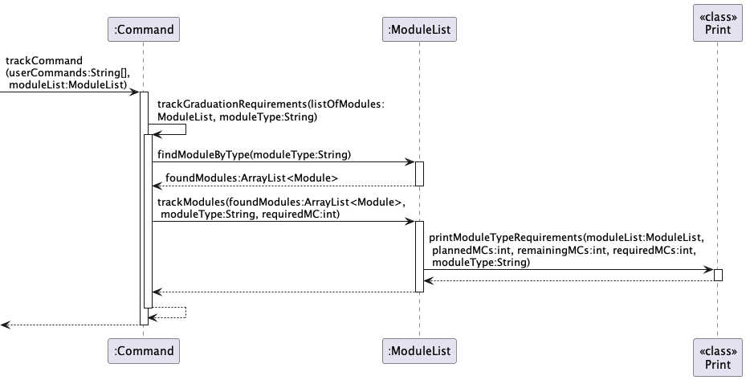

**Returning back to Table of Contents: [Table of contents](#table-of-contents)**

---

### 4.8 Add Grade

`grade` command:

The `grade` command is used by the user to add the grade of modules that are in the module plan.

The sequence by which the Parser class handles the `grade` command is as follows:
1. The `Parser` class extracts the commands from the user input and calls upon the `gradeCommand()` method
   in the `Command` class.
2. The `Command` class extracts the other fields of the user input, and calls upon the `updateModuleGrade()` method
   in the `ModuleList` class.
3. The method then loops through the moduleList array to find the moduleCode that requires a grade addition by the user.
4. If the module is found, the module code is checked for validation on whether the grade has already been set before.
5. If the grade has been set already, an exception is thrown to prompt the user to update the grade using
the `edit` command instead.
6. Otherwise, it calls the `setGrade()` method of the `Module` class to update the grade field of the
`Module` object and prints a success message by calling the `printUpdatedModuleGrade()` method of the `Print` class.
7. Else, it prints an error message by calling the `printInvalidModule()` method of the `Print` class.

The sequence of events above can be represented with the following sequence diagram:

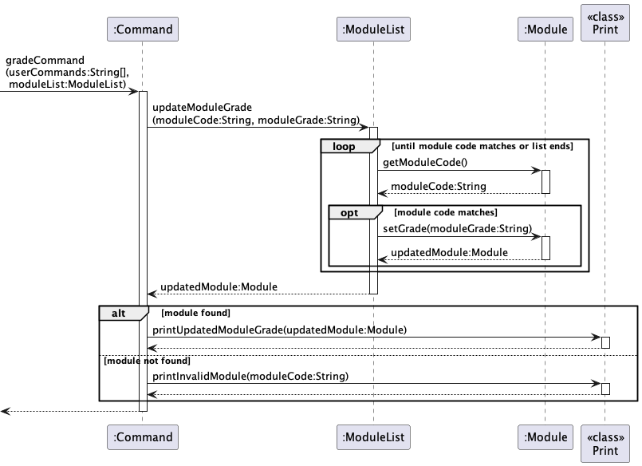

**Returning back to Table of Contents: [Table of contents](#table-of-contents)**

---

### 4.9 Calculate CAP

`calculateCAP` command:

The `calculateCAP` command is used by the user to calculate the Cumulative Average Point (CAP) of graded modules.

The sequence by which the Parser class handles the `calculateCAP` command is as follows:
1. The `Parser` class extracts the commands from the user input and calls upon the `calculateCAPCommand()` method
   in the `Command` class.
2. The `calculateCAPCommand()` method extracts the other fields of the user input, and calls upon the 
`calculateCAP()` method in the `ModuleList` class.
3. The method then loops through the moduleList array to find modules that already have grades.
4. It checks if the module grade should be counted by self-invocation of the `shouldCountModuleGrade()` method
5. If it is, proceeds to obtain the grade value by self-invocation of the `getGradeValue()` method.
6. Calculates the accumulated grade values and their weightages based on modular credits, and finally calls the
`printCalculatedCAP()` of the `Print` class to display the calculated CAP to the user

The sequence of events above can be represented with the following sequence diagram:

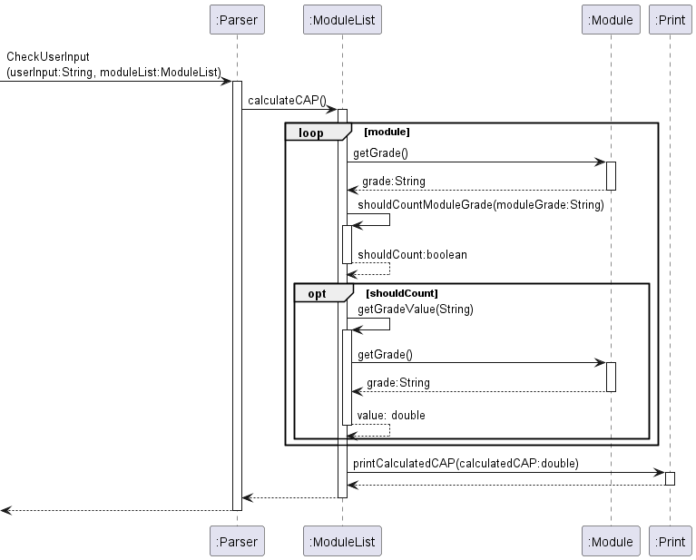

**Returning back to Table of Contents: [Table of contents](#table-of-contents)**

---

## 5. Documentation, logging and testing

---

### 5.1 Documentation
**Setting up and maintaining the project website:**

* The `docs/` folder is used for documentation.

**Style guidance:**

* Follow the [**_Google developer documentation style guide_**](https://developers.google.com/style).

* Also relevant is the [_[se-edu/guides] **Markdown coding standard**_](https://se-education.org/guides/conventions/markdown.html)

**Diagrams:**

* See the [_[se-edu/guides] **Using PlantUML**_](https://se-education.org/guides/tutorials/plantUml.html)

**Returning back to Table of Contents: [Table of contents](#table-of-contents)**

---

### 5.2 Logging

* We are using `java.util.logging` package for logging.
* The logger is initialised in the `Main` class.
* The logging levels that we use are `INFO` and `WARNING`, according to the conventions given in [[se-edu/guides] Java: Logging conventions.](https://se-education.org/guides/conventions/java/logging.html)
* `INFO` messages are used to document the running process of the program and `WARNING` messages are logged when the program runs into an error.
* Logging information and log messages are written into a `modganiserLog` text file.

**Returning back to Table of Contents: [Table of contents](#table-of-contents)**

---

### 5.3 Testing
#### Running tests

There are two ways to run tests.

* **Method 1: Using IntelliJ JUnit test runner**
   * To run all tests, right-click on the `src/test/java` folder and choose `Run 'All Tests'`
   * To run a subset of tests, you can right-click on a test package,
     test class, or a test and choose `Run 'ABC'`
* **Method 2: Using Gradle**
   * Open a console and run the command `gradlew clean test` (Mac/Linux: `./gradlew clean test`)

#### Types of tests

This project has two types of tests:

1. *ModuleList Tests* that are checking multiple code functions.
   e.g. `seedu.main.ModuleListTest`
2. *Print Tests* that are checking multiple outputs to the program.
   e.g. `seedu.main.PrintTest`

**Returning back to Table of Contents: [Table of contents](#table-of-contents)**

---

## 6. Appendix: Requirements

---

### 6.1 Product Scope

**Target User Profile**

+ Information Security students in NUS
+ Has a need to organise and manage their modules
+ Can type fast
+ Prefers typing to mouse interactions

**Value Proposition**

Better organisation of modules across 4 years in NUS and allow for more convenient planning as 
compared to when using other applications

**Returning back to Table of Contents: [Table of contents](#table-of-contents)**

---

### 6.2 User Stories

| Priority | As a...      | I want to...                                       | So that I can...                                                                       |
|----------|--------------|----------------------------------------------------|----------------------------------------------------------------------------------------|
| High     | New user     | See usage instructions                             | Refer to them when I forget the commands                                               |
| High     | Current user | Add modules                                        | To plan out my 4 years in NUS                                                          |
| High     | Current user | Delete modules                                     | To edit my plan when necessary                                                         |
| High     | Current user | Edit the details of current modules                | Change the details should I made a mistake or there was an update from NUS             |
| High     | Current user | View all my modules                                | Visualise my 4 year plan                                                               |
| High     | Current user | View my modules by year                            | Focus better on 1 year rather than all 4 years                                         |
| Medium   | Current user | Track my modules by type                           | Have an overview of my completion status of all types of modules                       |
| Medium   | Current user | Track the completion status of each module type    | Ensure that the MC requirements of each type of module is met                          |
| Medium   | Current user | Update the grade I got for a module                | Keep track of my grades                                                                |
| Medium   | Current user | Calculate my CAP                                   | Know my current CAP and project what honours I’ll graduate with                        |
| Medium   | New user     | See usage instructions based on feature            | Get more in-depth knowledge on the feature that I require                              |
| Medium   | Current user | Find a module by its code                          | Locate a specific module without having to go through the entire list of modules       |
| Medium   | Current user | Find a module by its type                          | Locate all modules in a specific category without having to go through the entire list |
| Low      | Current user | Sort modules by their module codes when listed out | Find similarly coded modules easily                                                    |

**Returning back to Table of Contents: [Table of contents](#table-of-contents)**

---

### 6.3 Use Cases

For all use cases below, the **System** is `Modganiser` and the **Actor** is the `user`

**Use case: Edit a module's year**

**Main Success Scenario (MSS):**
1. User requests to list all modules
2. Modganiser shows the list of modules in the plan
3. User requests to edit the year of a specific module
4. Modganiser edits the year of the specific module and displays the details of the updated module

**Extensions:**
+ 2a. The list of modules is empty.
  + 2a1. Modganiser displays a relevant error message.

    Use case ends.

+ 3a. The specified module does not exist.
  + 3a1. Modganiser displays a relevant error message.
  
    Use case resumes at step 2.

+ 3b. The newly specified year is invalid.
   + 3b1. Modganiser displays a relevant error message.

     Use case resumes at step 2.

**Use case: Delete a module**

**Main Success Scenario (MSS):**
1. User requests to list all modules
2. Modganiser shows the list of modules in the plan
3. User requests to delete a specific module in the list
4. Modganiser deletes the specific module and displays the details of the deleted module

**Extensions:**
+ 2a. The list of modules is empty.
   + 2a1. Modganiser displays a relevant error message.

     Use case ends.

+ 3a. The specified module does not exist.
   + 3a1. Modganiser displays an error message.

     Use case resumes at step 2.

**Returning back to Table of Contents: [Table of contents](#table-of-contents)**

---

### 6.4 Non-Functional Requirements

1. Should work on any mainstream OS as long as it has Java 11 or above installed
2. Should be able to hold up to 1000 modules without a noticeable sluggishness in performance for typical usage.
3. A user should be clear about the required inputs without any confusion about the commands.
4. A user should easily understand the visual feedback displayed to them in response to their commands.
5. A user should find the required inputs intuitive such that they do not need to constantly refer to the manual page
   for help
6. A user with above average typing speed for regular English text (i.e. not code, not system admin commands) should be 
   able to accomplish most of the tasks faster using commands than using the mouse.

**Returning back to Table of Contents: [Table of contents](#table-of-contents)**

---

### 6.5 Glossary

Mainstream OS: Windows, Linux, Unix, OS-X, MacOS

**Returning back to Table of Contents: [Table of contents](#table-of-contents)**

---

## 7. Appendix: Instructions for Manual Testing

Below are some instructions to test the application manually.

> 📓 **Note**
>
> The following instructions merely serve as a reference by providing a starting point for testers to work on. Testers 
> are expected to do more exploratory testing by themselves.

### Launch and shutdown

1. Initial launch
   1. Download the jar file and move it into an empty folder
   2. Using terminal or command prompt, navigate to the folder containing the jar file
   3. Enter the command `java -jar tp.jar`
   
      Expected: Shows the welcome message and prompts the user for his/her name.

2. Quitting the application
   1. Quit the application using the command `bye`
      
      Expected: Shows the goodbye message and the application is shut down 

### Adding a module 

1. Adding a module when there are no modules in the list
   1. Test case: `add /CS1010 /4 /CORE /1 /1`
      
      Expected: Module is successfully added to the list and a success message displayed. The number of modules
      in the list should be 1 at this point.

   2. Test case: `add /CS1010 /4 /EASY /1 /1`

      Expected: Module is not added to the list. An error message is displayed along with the error details being shown 
      in the message.

   3. Other incorrect add commands to try: `add`, `add CS1010 /4 /CORE /1 /1`, `add /CS1010 /20 /CORE /1 /1`,
   `add /CS1010 /4 /CORE /x /y` (where x is > 4 or < 1 and y is not 1, 1.5, 2, or 2.5)

      Expected: Similar to previous erroneous case.

2. Adding a module when there are modules in the list
   1. Test case: `add /CS2106 /4 /CORE /2 /1`

      Expected: Module is successfully added to the list and a success message is displayed. The number of modules
      in the list should increase by 1.

   2. Other incorrect add commands to try: `add`, `add CS1010 /4 /CORE /1 /1`, `add /CS1010 /20 /CORE /1 /1`,
      `add /CS1010 /4 /CORE /x /y` (where x is > 4 or < 1 and y is not 1, 1.5, 2, or 2.5)

      Expected: Similar to previous erroneous cases.

### Deleting a module

1. Deleting a module when there are no modules in the list
   1. Test case: `delete /CS2105`

      Expected: No module is deleted. An error message is displayed along with the error details being shown
      in the message.

2. Deleting a module when there are modules in the list
   1. Test case: `delete /CS1010`

      Expected: Module is successfully deleted and a success message is displayed. The number of modules
      in the list should decrease by 1.

   2. Other incorrect add commands to try: `delete`, `delete CS1010`, `delete CORE`,

      Expected: No module is deleted. An error message is displayed along with the error details being shown
      in the message.

3. Deleting a module which does not exist in the list
   1. Ensure that the module CS2107 is not in your list currently
   2. Test case: `delete /CS2107`

      Expected: No module is deleted. An error message is displayed along with the error details being shown
      in the message.

### Saving Data

1. Dealing with missing data files
   1. Go to the folder containing the jar file which you have downloaded 
   2. In the same folder, find the "data" folder and navigate to it
   3. Find the "modules.txt" and "name.txt" files and delete both of them
   4. Launch the application as per normal
   
      Expected: Shows the welcome message and prompts the user for his/her name. `list /all` command shows that the
      list of modules is now empty.

**Returning back to Table of Contents: [Table of contents](#table-of-contents)**

