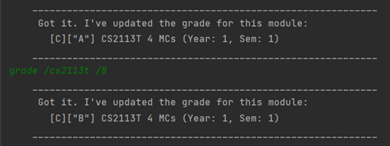

# User Guide

## Introduction

Modganiser is effortless module planning, at your fingertips via the Command Line Interface (CLI). 
It helps Information security students graduate in time by giving you a platform to plan all 4 
years of your modules to ensure that you meet graduation requirements (UE/GEs).  If you can type
fast, Modganiser can get your schedule up faster than traditional GUI apps.


## Quick Start

{Give steps to get started quickly}

1. Ensure that you have Java 11 or above installed.
2. Download the latest version of `Duke` from [here](http://link.to/duke).

Type the command in the command box and press Enter to execute it. e.g. typing man and pressing Enter will open the manual.
Some example commands you can try:


## Features 

### ManPage: `man`

List the command summary and shows more commands to get a better description of each feature. 

1. `man`
2. `man /add `
3. `man /list`
4. `man /edit`
5. `man /find`
6. `man /delete`
7. `man /calculator`
8. `man /grade`
9. `man /bye`

Viewing the full manpage:


Viewing the manpage for a single feature (ex. add):


### Add command: `add`

The add command is used to add a module to the module tracker. It is case and space insensitive.

Command: `add /{Module Code} /{Modular Credits} /{Module Type} /{Year} /{Semester}`

Accepted Inputs:

Module Code: Cannot be empty, must be 6 or more characters.

Modular Credits: [0-6, 8, 12]

Module Types: [Core, GE, UE, Internship] referring to Core, General Electives, Unrestricted Electives and Internships.

Year: [0-6]

Semester: [1, 1.5, 2, 2.5] referring to Semester 1, Semester 1 break (Special Term I), 
Semester 2, Semester 2 break (Special Term II)

Example Input: `add /CS2113T /4 /CORE /2 /2`

Expected Output: 
```    
    ____________________________________________________________
     Got it. I've added this module:
       [C][" "] CS2113T 4 MCs (Year: 2, Sem: 2)
     Now you have 1 modules in the list.
    ____________________________________________________________
```


### Find command: `find`

The find command can be used to find modules by its module code. It will list all modules that contains the KEYWORD in its module code

Command: `find /NAME /{KEYWORD}`

Example: `find /NAME /CS`

Expected Output:


<small><i>Figure ???</i></small>

Example: `find /NAME /CS2113T`

Expected Output:


<small><i>Figure ???</i></small>

The find command can also be used to find all modules of a module type. It will list all modules of a certain module type.

Command: `find /TYPE /{MODULE_TYPE}`

Accepted Inputs:

Module Types: [Core, GE, UE, Internship] referring to Core, General Electives, Unrestricted Electives and Internships.

Example: `find /TYPE /CORE`

Expected Output:


<small><i>Figure ???</i></small>

### Grade command: `grade`

The `grade` command can be used to input a valid grade when the user has completed a module.  
The `grade` command can also be used to update the grade for a module.

Command: `grade /MODULE_CODE /GRADE`

Example: `grade /CS2113T /A`

Expected Output:  

  
<small><i>Figure ???</i></small>

Example: `grade /CS2113T /B` after previous command

Expected Output:  

  
<small><i>Figure ???</i></small>

### CalculateCAP command: `calculatecap`

The `calculatecap` command can be used to calculate your Cumulative Average Point (CAP) across completed modules
based on grade values that you obtained.  
The result would be rounded off to 2 decimal places for the user.
+ Grades obtained correspond to a number that is used to calculate your cap. To find out more, do visit the
  official [NUS website](https://www.nus.edu.sg/registrar/academic-information-policies/modular-system) :)

Command: `calculatecap`

Example: `calculatecap`

Expected Output:

  
<small><i>Figure ???</i></small>

### Track command: `track`

Track command shows the completion status of each module type, ensuring that you have fulfilled all graduation requirements.

Command: `track /{MODULE_TYPE}`

Accepted Inputs:

Module Types: [CORE, GE, UE, INTERNSHIP, ALL] referring to Core, General Electives, Unrestricted Electives and Internships. 
ALL will show the completion status of all the above-mentioned module types.  

Example: `track /CORE`

Expected Output:


<small><i>Figure ???</i></small>


## FAQ

**Q**: How do I transfer my data to another computer? 

**A**: {your answer here}


## Command Summary
| Feature                         |                           Command                           |         
|---------------------------------|:-----------------------------------------------------------:|
| Viewing manual: command summary |                            `man`                            |
| Adding a module                 | `add /MODULE_CODE /MODULAR_CREDITS /MODULE_TYPE /YEAR /SEM` |
| Listing all modules in 4 years  |                         `list all`                          |
| Listing all modules in 1 year   |                        `list /YEAR`                         |
| Editing a module                |        `edit /MODULE_CODE /FIELD_TO_EDIT /NEW_INFO`         |
| Locating module by code         |         `find /MODULE_CODE or MODULE_TYPE /KEYWORD`         |
| Deleting a module from the list |                    `delete /MODULE_CODE`                    |
| Grade Calculator                |                       `calculatecap`                        |
| Input/Update Grades             |                 `grade /MODULE_CODE /GRADE`                 |
| Exiting the program             |                            `bye`                            |

