 
# Modganiser User Guide

## 1. Acknowledgements

---

We would like to thank you for choosing Modganiser to help you with your module planning.
Modganiser will be sure to make this arduous task a breeze while ensuring you meet all your graduation requirements,
so that you can focus on the other aspects of university that really matter.
Should you have any feedback or enquiries, please do not hesitate to [reach out to us](https://github.com/AY2223S2-CS2113T-T09-4/tp/issues) by clicking on the green "new issue" button and submitting it.

## 2. Introduction

---

Are you a current information security undergraduate at NUS? Or are you a prospective student,
about to begin your journey into information security? Well, Modganiser is exactly what you are looking for!

So why Modganiser? We have seen and heard of cases of undergraduates not being able to graduate on time as they have missed out certain requirements. For information security undergraduates who aim to obtain their degree in 4 years, Modganiser provides you a platform to effortlessly plan for the modules you wish to take during your undergraduate journey, all while ensuring that you meet the [graduation requirements](https://www.comp.nus.edu.sg/cugresource/per-cohort/isc/isc-21-22/) on time.

Modganiser works via the [Command Line Interface (CLI)](#8-glossary), and while it is a big difference compared to traditional Graphical User Interface (GUI) applications, If you can type fast, Modganiser is much more efficient!

This user guide will now help you navigate through Modganiser and its features. To find out about the various sections in this guide, please refer to the [Table of Contents](#table-of-contents) on the next page. If you are a new user, do navigate to the
[set-up section](#4-set-up-guide) to learn how to install and run Modganiser. To learn more about Modganiser’s features, do head over to
the [features section](#51-summary-of-features)!

---

## Table of Contents

---

1. [Acknowledgements](#1-acknowledgements)
2. [Introduction](#2-introduction)
3. [How To Use The User Guide](#3-how-to-use-the-user-guide)
    + 3.1 [Special Notations](#31-special-notations)
    + 3.2 [Notes on the Commands](#32-notes-on-the-commands)
4. [Set-Up Guide](#4-set-up-guide)
5. [Features](#5-features)
    + 5.1 [Summary Of Features](#51-summary-of-features)
    + 5.2 [Managing Modules in the Module Plan](#52-managing-modules-in-the-module-plan)
        - 5.2.1 [Adding Modules: add](#521-adding-modules-add)
        - 5.2.2 [Adding Grade Obtained for Module: grade](#522-adding-grade-obtained-for-module-grade)
        - 5.2.3 [Editing Module Details: edit](#523-editing-module-details-edit)
        - 5.2.4 [Deleting Module From Module Plan: delete](#524-deleting-module-from-module-plan-delete)
    + 5.3 [Display Modules in the Module Plan](#53-display-modules-in-the-module-plan)
        - 5.3.1 [Viewing Module Plan: list](#531-viewing-module-plan-list)
        - 5.3.2 [Finding Modules In The Module Plan: find](#532-finding-modules-in-the-module-plan-find)
    + 5.4 [Tracking Graduation Progress](#54-tracking-graduation-progress)
        - 5.4.1 [Tracking the Completion of Each Module Type: track](#541-tracking-the-completion-of-each-module-type-track)
        - 5.4.2 [Calculating Your Current CAP: calculatecap](#542-calculating-your-current-cap-calculatecap)
    + 5.5 [Miscellaneous](#55-miscellaneous)
        - 5.5.1 [Viewing the Entire Manual: man](#551-viewing-the-entire-manual-man)
        - 5.5.2 [Viewing the Detailed Manual Page for A Single Feature: man /FEATURE](#552-viewing-the-detailed-manual-page-for-a-single-feature-man-feature)
        - 5.5.3 [Exiting Modganiser: bye](#553-exiting-modganiser-bye)
        - 5.5.4 [Saving Module Plan](#554-saving-module-plan)
6. [FAQ](#6-faq)
7. [Command Summary](#7-command-summary)
8. [Glossary](#8-glossary)

<small>Click <a href="#table-of-contents">here</a> to return to the Table of Contents</small>

---

## 3. How To Use The User Guide

---

Modganiser uses a [Command Line Interface (CLI)](#8-glossary) which may be new to some users. We strongly recommend that you read this
User Guide from start to finish if you are new to Modganiser, although you may choose to skip to more relevant sections
if you are used to Java, CLI or Modganiser, which are described below:
* Our [Table of Contents](#table-of-contents) helps you to  navigate between the different sections quickly.
* Our [Set-Up Guide](#4-set-up-guide) provides step-by-step instructions on how to install Modganiser and how to use the [Command Line Interface](#8-glossary).
* Have a look at the [Features](#51-summary-of-features) that Modganiser offers!
* The [FAQ](#6-faq) has answers to the most frequently asked questions.
* A [Command Summary](#7-command-summary) is provided to give an overview of the different commands available in Modganiser and their respective formats.
* The [Glossary](#8-glossary) provides an explanation to the more technical terms in our user guide.

<small>Click <a href="#table-of-contents">here</a> to return to the Table of Contents</small>

---

### 3.1 Special Notations
Before we begin, here are some special notations that we will be using. It would be good to familiarize yourself with these notations as it will enhance your experience with the user guide.

**Tips**

Tips are useful suggestions that will help you have a better experience with Modganiser.

> 💡 **Tip**: Tips are useful

**Notes**

Notes are important information that you should pay attention to when using Modganiser.

> 📓 **Note**: Notes are important, take them down

**Warnings**

Warnings are to warn you of potential pitfalls that new users may encounter. 

> ❗ **Warning**: Read this section carefully when you see it

<small>Click <a href="#table-of-contents">here</a> to return to the Table of Contents</small>

---

### 3.2 Notes on the Commands

>❗ **Warning**
> 
>  Errors and Warnings
>   - When you have missing or additional inputs compared to the number of [parameter](#8-glossary) needed for that command, an error will be thrown by Modganiser.
>
>   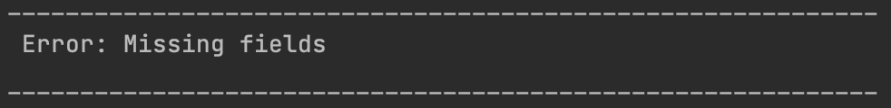
>
>   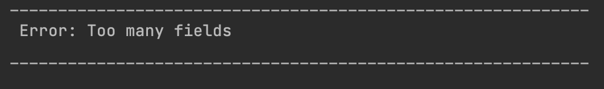
>
>   - Modganiser will also throw other types of errors and warnings when you do not follow the [command format](#7-command-summary) or accepted inputs for the respective commands. 
>   - Please read the error message carefully to rectify the mistake in your input. Thank you!

<small>Click <a href="#table-of-contents">here</a> to return to the Table of Contents</small>

---

> 📓 [**Note**](#31-special-notations)
> 1. Markdown Texts
>   - Markdown texts are texts that look like `this`, which indicates that these texts are user inputs.
> 2. Command Words
>   - Command words are used to invoke the various features of Modganiser.
>   - You may refer to the [command summary](#7-command-summary) for the list of command words.
>   - Command words are not case-sensitive.
>   - Example: `BYE` will be accepted as the `bye` command.
> 3. Parameters
>   - Words in UPPER_CASE refers to the [parameters](#8-glossary) of the command and require a user input.
>   - All inputs for the [parameters](#8-glossary) should come with a slash “/” before it.
>   - Inputs from you are not case-sensitive. All inputs will be converted to uppercase before
      they are executed. Therefore, inputs like `/cs2113t` will be treated as `/CS2113T` by
      default. For example, `find /CODE /Cs2113t` will be treated as `FIND /CODE /CS2113T` by Modganiser.
>   - You should provide as many inputs as there are [parameter](#8-glossary) fields for the command.
> 4. How To Interpret Screenshots
>   - Screenshots serve as a visual aid to help you understand Modganiser's various features and they are exact replicas of what you would see.
>   - User inputs will always be flushed to the left of the Command Line Interface window while Modganiser responses will be indented right.
>   - However, to help you differentiate between a user input and Modganiser's response better in the user guide, all user inputs will be shown in green while Modaganiser's responses are in white.
>   
>   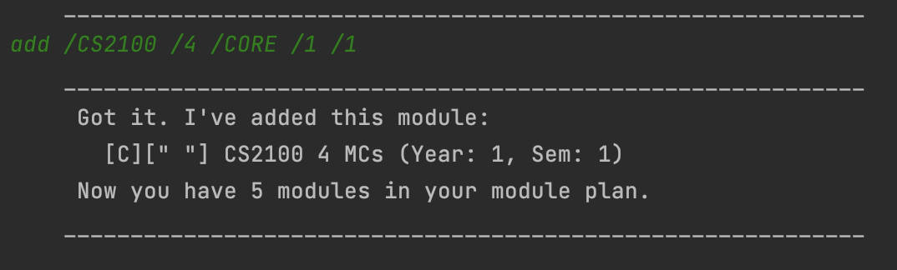

Now that you are better acquainted with this guide, let's talk about how to install Modganiser!

<small>Click <a href="#table-of-contents">here</a> to return to the Table of Contents</small>

---

## 4. Set-Up Guide

---

To set up Modganiser, please follow the steps below:
1. Download Java from the Java Developer Webpage.
    * For Windows, please click [here](https://www.oracle.com/java/technologies/downloads/#jdk20-windows) and choose the x64 installer and follow the installer instructions.
    * For macOS, please click [here](https://www.oracle.com/java/technologies/downloads/#jdk20-mac) and choose the Arm 64 DMG Installer and follow the installer instructions.

2. Please click [here](https://github.com/AY2223S2-CS2113T-T09-4/tp/releases) and download the file titled "tp.jar" which contains Modganiser.

3. Create an empty folder on your Desktop, title the folder "Modagniser" and save the "tp.jar" file inside it.

4. Open the [CLI interface](#8-glossary) on your device
    * For Windows, click on the Windows button and search for “Command Prompt”.
    * For macOS, press on the command and spacebar button together and search for “Terminal”.
    * The window that appears is the CLI on your computer. We will be using this interface to run Modganiser.
    * Make the window full screen by clicking on the square icon on the top right if you are using a Windows device or the green button on the top left if you are using a macOS device.

   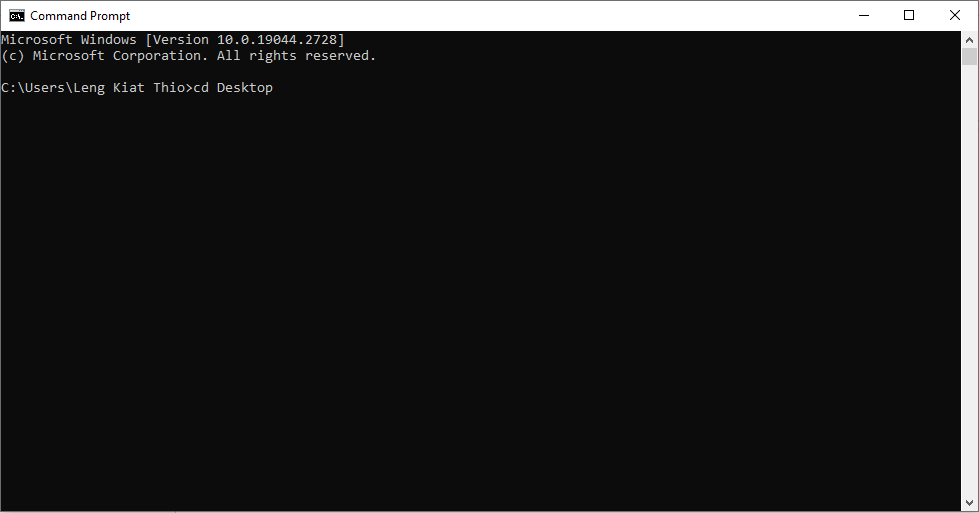
   
<small>Windows version of CLI with a command typed out</small>

   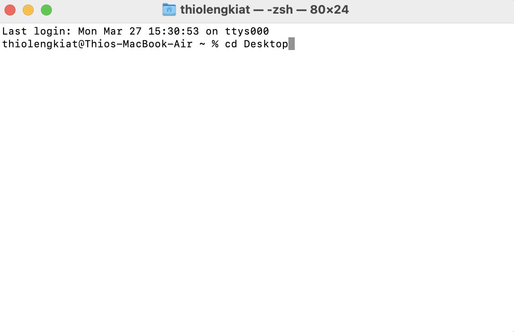
   
<small>macOS version of CLI with a command typed out</small>

5. Run the following commands:
    * Type “cd Desktop” and press enter.
    * Type “cd Modganiser” and press enter.
    * Type “java -jar tp.jar” and press enter.

6. If successful, you should see the following displayed on your screen:

   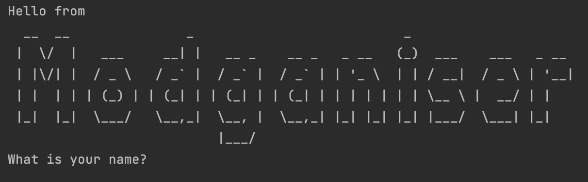

7. Type your name in and press enter. If successful, you should see the following:

   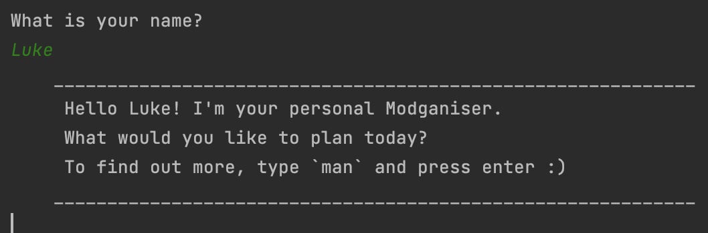

8. Modganiser is now ready to run. You can type commands at the bottom after the horizontal line.

> 📓 **Note**
>
> If your name is "bye", please use an alias instead. Please refer to the [FAQ Section](#6-faq) for more information. 

All right! Modganiser is now installed onto your device. Move on to the next section to find out more about the various features that Modganiser has.

<small>Click <a href="#table-of-contents">here</a> to return to the Table of Contents</small>

---

## 5. Features

---

### 5.1 Summary Of Features
Below is a summary of features that Modganiser has. To use the features, please refer to the [command summary](#7-command-summary) for their respective command formats.

[Managing Modules in the Module Plan:](#52-managing-modules-in-the-module-plan)
- [Add](#521-adding-modules-add), [edit](#523-editing-module-details-edit) and [delete](#524-deleting-module-from-module-plan-delete) modules from your plan and [input the grade](#522-adding-grade-obtained-for-module-grade) obtained for a module.

[Display Modules in the Module Plan:](#53-display-modules-in-the-module-plan)
- [Listing modules by year](#531-viewing-module-plan-list) and [finding module by module code or module type](#532-finding-modules-in-the-module-plan-find).

[Tracking Graduation Progress:](#54-tracking-graduation-progress)
- [Track Completion status of module type](#541-tracking-the-completion-of-each-module-type-track) and [calculate your CAP](#542-calculating-your-current-cap-calculatecap).

[Miscellaneous:](#55-miscellaneous)
- [Viewing the manual](#551-viewing-the-entire-manual-man) in Modganiser, [exiting Modganiser](#553-exiting-modganiser-bye) and [saving your module plan](#554-saving-module-plan).

<small>Click <a href="#table-of-contents">here</a> to return to the Table of Contents</small>

---

### 5.2 Managing Modules in the Module Plan

#### 5.2.1 Adding Modules: `add`

**Function**

When you have found a module that you would wish to take, you can use this command to add the module to the module plan with the following [parameters](#8-glossary):

| [Parameter](#8-glossary) | Description                                                           | Accepted Inputs                                                 |
|--------------------------|-----------------------------------------------------------------------|-----------------------------------------------------------------|
| MODULE_CODE              | Please refer to [NUSMods](https://nusmods.com) for the Module's Code  | All inputs consisting of [alphanumeric](#8-glossary) characters |
| MODULAR_CREDITS          | The number of modular credits the module is worth                     | 0-41, with no decimal places                                    |
| MODULE_TYPE              | Which category the module falls under                                 | [CORE, GE, UE, INTERNSHIP](#8-glossary)                         |
| YEAR                     | Which year you plan to take the module                                | 1, 2, 3, 4, with no decimal places                              |
| SEMESTER                 | Which semester you plan to take the module                            | 1, 1.5, 2, 2.5, with no additional decimal places               |

> 📓 [**Note**](#31-special-notations)
>
> 1.5 and 2.5 for SEMESTER refers to Special Term 1 and Special Term 2 respectively.

>❗ [**Warning**](#31-special-notations)
>
> - Validity of inputs for MODULE_CODE, MODULAR_CREDITS and MODULE_TYPE is not checked as we cannot maintain a database of modules. 
> - Please double-check the module code and credits on [NUSMods](https://nusmods.com) before entering it into Modganiser. 
> - Furthermore, a module may be taken as a [GE module](#8-glossary) for you but could be taken as a [UE module](#8-glossary) for another user. Please determine the module type by referring to the [graduation requirements](https://www.comp.nus.edu.sg/cugresource/per-cohort/isc/isc-21-22/) before entering it into Modganiser.
> - If you have entered the wrong input for the aforementioned [parameters](#8-glossary), you may edit it using the [edit command](#523-editing-module-details-edit).

<small>Click <a href="#51-summary-of-features">here</a> to return to the summary of features</small>

<small>Click <a href="#table-of-contents">here</a> to return to the Table of Contents</small>

**Command Format**

`add /MODULE_CODE /MODULAR_CREDITS /MODULE_TYPE /YEAR /SEMESTER`

Example: `add /CS2113T /4 /CORE /1 /1`. adds the module CS2113T that is worth 4 Modular Credits(MCs) and is a [Core module](#8-glossary) into Year 1 Semester 1.

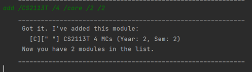

> 📓 [**Note**](#31-special-notations)
>
> The C in the first square bracket represents [Core Module](#8-glossary). [GE](#8-glossary), [UE](#8-glossary) and [Internship](#8-glossary) Modules are represented with “GE”, “UE” and “I” respectively as shown in the images below.
>
> 
> 
> 

>❗ [**Warning**](#31-special-notations)
>
> Missing inputs for the various [parameters](#8-glossary) or having too many inputs for the [parameters](#8-glossary) will cause Modganiser to throw you a warning as shown in the [Notes On The Commands](#32-notes-on-the-commands) section.

<small>Click <a href="#51-summary-of-features">here</a> to return to the summary of features</small>

<small>Click <a href="#table-of-contents">here</a> to return to the Table of Contents</small>

---

> 💡 [**Tip**](#31-special-notations)
>
> As you will likely take an average of 5 modules in a semester, advanced users can take advantage of being able to add multiple modules with one command.
>
> For example: `add /CS2113T IS4231 CS3235 /4 /CORE /1 /1` will add CS2113T, IS4231 and CS3235 into the module plan. All 3 modules will be reflected as [Core](#8-glossary) modules worth 4 MCs, and will be taken in Year 1 Semester 1.
> 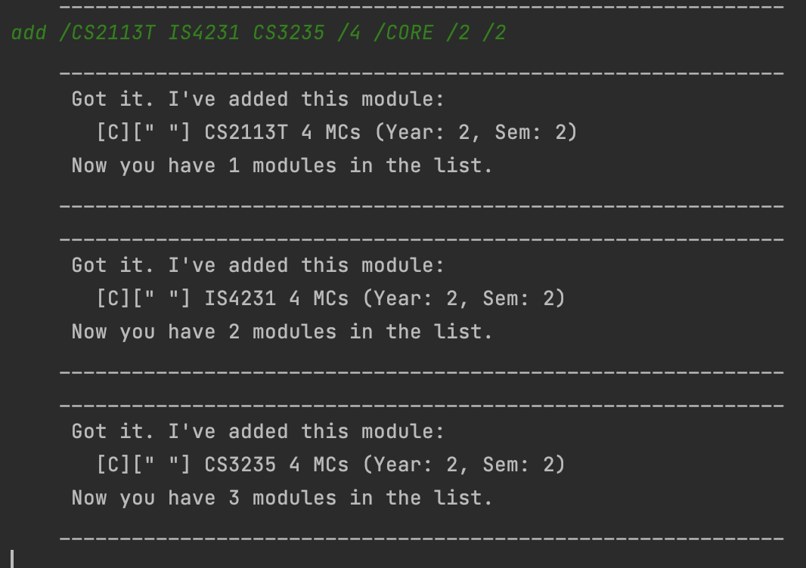

>❗ [**Warning**](#31-special-notations)
>
> Adding multiple modules should only be used if all the modules have the same inputs for MODULE_TYPE, MODULAR_CREDITS, YEAR and SEMESTER. Example, SIP3200 and CS2113T should not be added together with a single command as SIP3200 is worth 6 modular credits while CS2113T is worth 4 modular credits.

<small>Click <a href="#51-summary-of-features">here</a> to return to the summary of features</small>

<small>Click <a href="#table-of-contents">here</a> to return to the Table of Contents</small>

---

#### 5.2.2 Adding Grade Obtained for Module: `grade`
**Function**

After you have finished the module, you will receive a grade for it. Input the grade you got for the module into Modganiser using this command which is used to [calculate your CAP](#542-calculating-your-current-cap-calculatecap).

|   [Parameter](#8-glossary)    |              Description              |                     Accepted Inputs                     |
|:--------------:|:-------------------------------------:|:-------------------------------------------------------:|
| MODULE_CODE |           The module's code           | All inputs consisting of [alphanumeric](#8-glossary) characters                       |
|    GRADE     | The grade you obtained for the module | A+, A, A-, B+, B, B-, C+, C, C-, D+, D, F, S, U, CS, CU |

**Command Format**

`grade /MODULE_CODE /GRADE`

Example: `grade /CS2113T /A` adds grade “A” to CS2113T

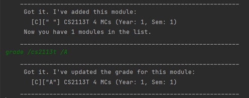

<small>Click <a href="#51-summary-of-features">here</a> to return to the summary of features</small>

<small>Click <a href="#table-of-contents">here</a> to return to the Table of Contents</small>

---

> 📓 [**Note**](#31-special-notations)
>
> The grades for modules will be empty initially and will have a blank 2nd square bracket [“ ”] which needs to be 
> updated via this command.
> 
> 

> 📓 [**Note**](#31-special-notations)
>
> For ease of convenience, we have decided not to include Exempted(EXE), Incomplete(IC), In Progress(IP) 
> and Withdrawn(W) as a valid grade input as users can [delete](#524-deleting-module-from-module-plan-delete) and 
> [add](#521-adding-modules-add) the module should they wish to retake the module another time.

>❗ [**Warning**](#31-special-notations)
>
> Modganiser will show an error if you add grades to a module that already has a grade.
>
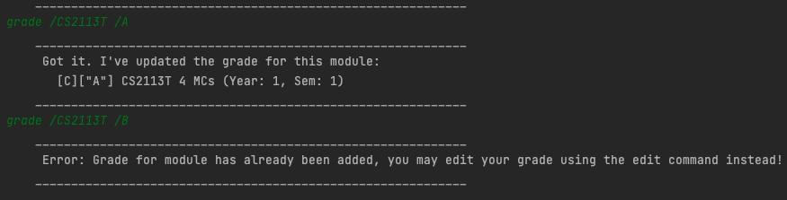

>❗ [**Warning**](#31-special-notations)
>
> Modganiser will show an error if you add grades to a module that doesn't exist.
> 
> 

<small>Click <a href="#51-summary-of-features">here</a> to return to the summary of features</small>

<small>Click <a href="#table-of-contents">here</a> to return to the Table of Contents</small>

---

#### 5.2.3 Editing Module Details: `edit`

**Function**

If you entered wrong details for a module when adding it to your module plan or if the details of the module have changed over time, you can use this command to edit the module's details.

|   [Parameter](#8-glossary) |                                Description                                 |                                                                         Accepted Inputs                                                                         |
|:--------------------------:|:--------------------------------------------------------------------------:|:---------------------------------------------------------------------------------------------------------------------------------------------------------------:|
|        MODULE_CODE         | Please refer to [NUSMods](https://nusmods.com) for the correct module code | All inputs consisting of [alphanumeric](#8-glossary) characters                       |
|       FIELD_TO_EDIT        |      The [parameter](#8-glossary) of the module that you wish to edit      |                                                              CODE, MC, TYPE, YEAR, SEMESTER, GRADE                                                              |
|          NEW_INFO          |   The new information to replace the incorrect or outdated information.    | Accepted inputs will be based on the field to edit. Please refer to the accepted inputs for the respective fields in the [add command](#521-adding-modules-add). |

> 📓 [**Note**](#31-special-notations)
> For the accepted inputs for FIELD_TO_EDIT:
> * CODE represents MODULE_CODE
> * MC represents MODULAR_CREDITS
> * TYPE represents MODULE_TYPE

**Command Format**

`edit /MODULE_CODE /FIELD_TO_EDIT /NEW_INFO`

Example: `edit /CS2113T /TYPE /UE` edits the [Module Type](#8-glossary) of CS2113T to [UE](#8-glossary)

Expected Output:

Example: `edit /CS2113T /MC /8` edits the current Modular Credits that CS2113T is worth to 8.

Expected Output:

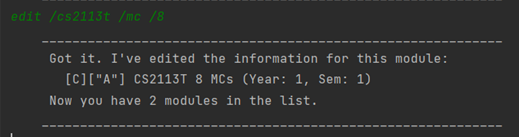

> ❗ [**Warning**](#31-special-notations)
>
> Modganiser will show an error if you edit a module that doesn't exist in your module plan.
>
>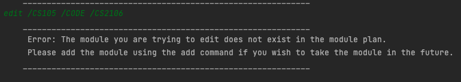

> ❗ [**Warning**](#31-special-notations)
>
> Modganiser will show an error if you edit a grade for a module that has not been graded yet.
>
>

<small>Click <a href="#51-summary-of-features">here</a> to return to the summary of features</small>

<small>Click <a href="#table-of-contents">here</a> to return to the Table of Contents</small>

---

#### 5.2.4 Deleting Module From Module Plan: `delete`
**Function**

Should you no longer wish to take a module, you can use this command to delete the module from your module plan.

|  [Parameter](#8-glossary)  |    Description    |                                                               Accepted Inputs                                                                |
|:-----------:|:-----------------:|:--------------------------------------------------------------------------------------------------------------------------------------------:|
| MODULE_CODE | The module's code | All inputs consisting of [alphanumeric](#8-glossary) characters                       |

**Command Format**

`delete /MODULE_CODE`

Example: `delete /CS2113T` deletes CS2113T module from the module plan

> ❗ [**Warning**](#31-special-notations)
>
> Modganiser will show an error if you delete a module that doesn't exist in your module plan.
>
>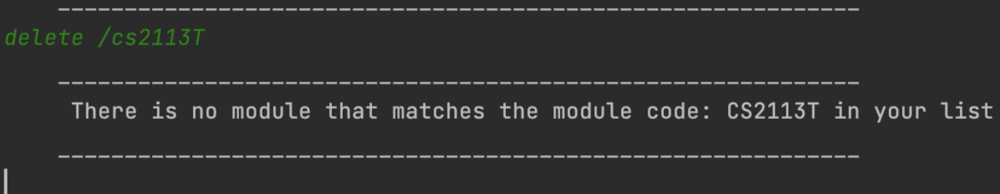

<small>Click <a href="#51-summary-of-features">here</a> to return to the summary of features</small>

<small>Click <a href="#table-of-contents">here</a> to return to the Table of Contents</small>

---

### 5.3 Display Modules in the Module Plan

#### 5.3.1 Viewing Module Plan: `list`

**Function**

When you want to view your 4 year module plan or a specific year of your module plan, you can use this command to do so.

| [Parameter](#8-glossary) |                      Description                       |                  Accepted Inputs                  |
|:------------------------:|:------------------------------------------------------:|:-------------------------------------------------:|
|           YEAR           | The specific year of your module plan you wish to view | ALL, 1, 2, 3, 4 with no additional decimal places |

**Command Format**

`list /YEAR`

Example: `list /ALL` lists the entire module plan.

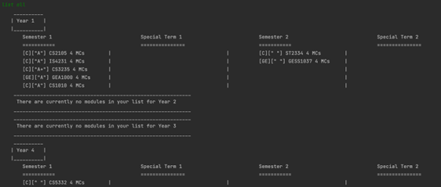

<small>Click <a href="#51-summary-of-features">here</a> to return to the summary of features</small>

<small>Click <a href="#table-of-contents">here</a> to return to the Table of Contents</small>

---

Example: `list /1` lists Year 1's module plan.

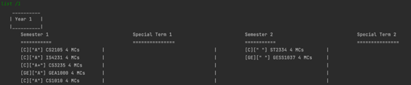

<small>Click <a href="#51-summary-of-features">here</a> to return to the summary of features</small>

<small>Click <a href="#table-of-contents">here</a> to return to the Table of Contents</small>

---

#### 5.3.2 Finding Modules in the Module Plan: `find`
**Function**

You can use this command to find all the modules that contain your keyword, module type or a specific module.

|   [Parameter](#8-glossary)    |                          Description                           |                                                                                                  Accepted Inputs                                                                                                  |
|:--------------:|:--------------------------------------------------------------:|:-----------------------------------------------------------------------------------------------------------------------------------------------------------------------------------------------------------------:|
| TYPE_OF_SEARCH |    Specifies to search using the module code or [module type](#8-glossary)    |                                                                                                     CODE, TYPE                                                                                                    |
|    KEYWORD     |                   The keyword to search for                    | If TYPE_OF_SEARCH is CODE, All inputs consisting of [alphanumeric](#8-glossary) characters will be accepted. However, if TYPE_OF_SEARCH is TYPE, only [CORE, GE, UE and INTERNSHIP](#8-glossary) will be accepted |

**Command Format**

`find /TYPE_OF_SEARCH /KEYWORD`

Example: `find /TYPE /CS2113T` finds all modules that contains CS2113T in their module code.

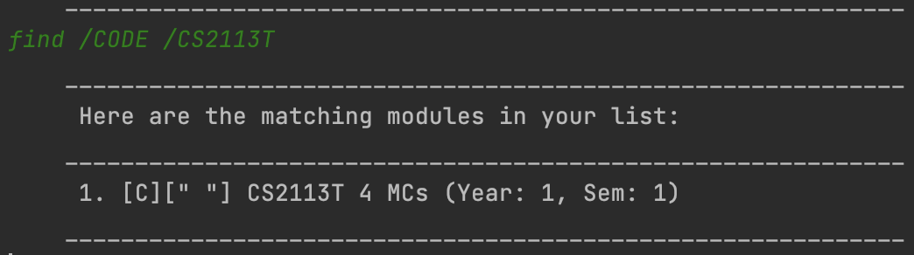

<small>Click <a href="#51-summary-of-features">here</a> to return to the summary of features</small>

<small>Click <a href="#table-of-contents">here</a> to return to the Table of Contents</small>

---

Example: `find /CODE /CS` finds all modules whose module code contains the keyword “CS”.

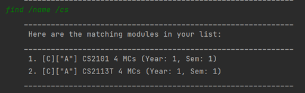

Example: `find /TYPE /CORE` finds all modules whose [module type](#8-glossary) is [Core](#8-glossary).

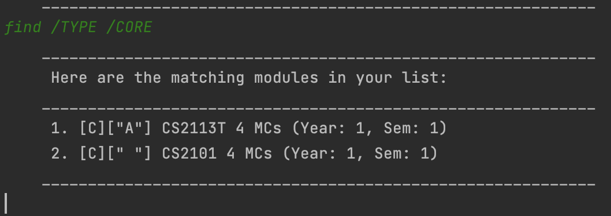

> ❗ [**Warning**](#31-special-notations)
>
> Modganiser will show an error if you use the find command when your module plan is empty.
>
>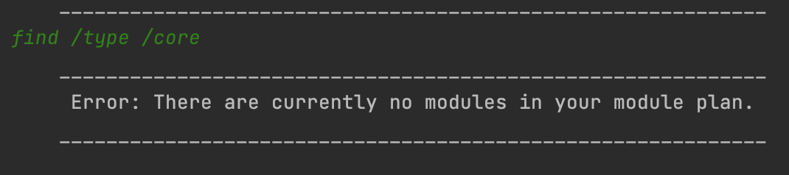

<small>Click <a href="#51-summary-of-features">here</a> to return to the summary of features</small>

<small>Click <a href="#table-of-contents">here</a> to return to the Table of Contents</small>

---

### 5.4 Tracking Graduation Progress

#### 5.4.1 Tracking the Completion of Each Module Type: `track`

**Function**

To know how far you are from fulfilling your graduation requirements, you can use this command to track how many modular credits of a [module type](#8-glossary) you have already added to your module plan.   
Modganiser will then list out all the modules that you have planned under that specific [module type](#8-glossary) and display how many more modular credits is needed before you meet the graduation requirements for that [module type](#8-glossary).  
Additionally, you can also track all the planned modules filtered by their [module type](#8-glossary) at once if you wish to do so.

|  [Parameter](#8-glossary)  |                   Description                    |        Accepted Inputs        |
|:-----------:|:------------------------------------------------:|:-----------------------------:|
| MODULE_TYPE | The [module type](#8-glossary) whose status you want to look up | ALL, [CORE, GE, UE, INTERNSHIP](#8-glossary) |

**Command Format**

`track /MODULE_TYPE`

Example: `track /CORE` tracks the completion status of your [core modules](#8-glossary).

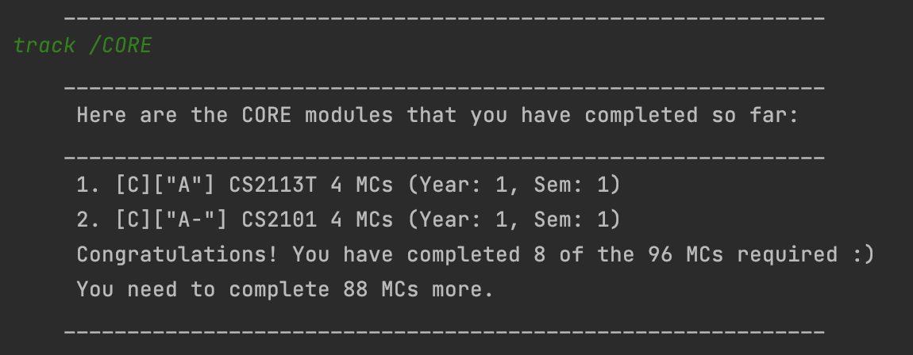

<small>Click <a href="#51-summary-of-features">here</a> to return to the summary of features</small>

<small>Click <a href="#table-of-contents">here</a> to return to the Table of Contents</small>

---

Example: `track /ALL` tracks all the planned modules filtered by [module type](#8-glossary).

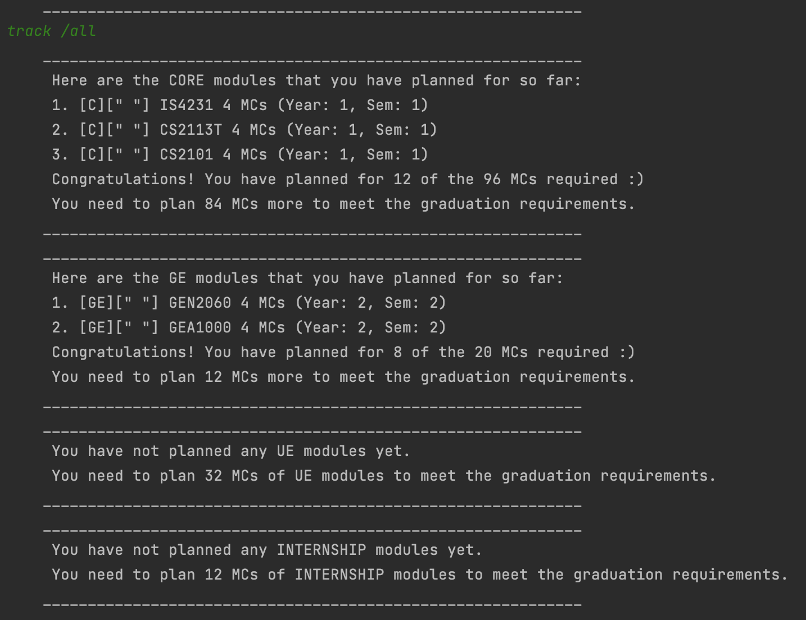

<small>Click <a href="#51-summary-of-features">here</a> to return to the summary of features</small>

<small>Click <a href="#table-of-contents">here</a> to return to the Table of Contents</small>

---

#### 5.4.2 Calculating Your Current CAP: `calculatecap`
**Function**

When you want to know your current CAP, you can use this command to calculate it based on the grades you obtained. Grades obtained correspond to a number that is used to calculate your CAP.  
To find out more about how your CAP is calculated, do visit the official [NUS website](https://www.nus.edu.sg/registrar/academic-information-policies/modular-system).

|  [Parameter](#8-glossary)  |                   Description                    |        Accepted Inputs        |
|:-----------:|:------------------------------------------------:|:-----------------------------:|
| NIL | NIL | NIL |

**Command Format**

`calculatecap`

Example: `calculatecap` calculates your current CAP

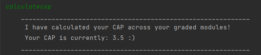

> 📓 [**Note**](#31-special-notations)
>
> To input the grade you obtained for the module, please refer to the [grade command](#522-adding-grade-obtained-for-module-grade).

> 📓 [**Note**](#31-special-notations)
> 
> Modules that are graded with S, U, CS or CU will **not** be calculated to your CAP, since they are modules with no grade value.  
> This aligns with how [NUS calculates your CAP](https://www.nus.edu.sg/registrar/academic-information-policies/non-graduating/modular-system).

<small>Click <a href="#51-summary-of-features">here</a> to return to the summary of features</small>

<small>Click <a href="#table-of-contents">here</a> to return to the Table of Contents</small>

---

### 5.5 Miscellaneous
#### 5.5.1 Viewing the Entire Manual: `man`

**Function**

While using Modganiser, you may forget the various commands or the parameters of the commands. You may use this command to show a summary of all the available commands.

| [Parameter](#8-glossary) | Description | Accepted Inputs |
|:---------:|:-----------:|:---------------:|
|    NIL    |     NIL     |       NIL       |

**Command format**

`man`

Example : `man` displays the manual page

Expected Output:

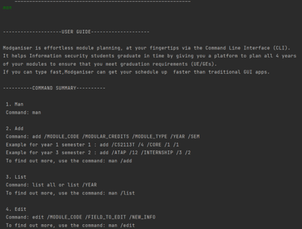

<small>Click <a href="#51-summary-of-features">here</a> to return to the summary of features</small>

<small>Click <a href="#table-of-contents">here</a> to return to the Table of Contents</small>

---

#### 5.5.2 Viewing the Detailed Manual Page for A Single Feature: `man /FEATURE`

**Function**

When using Modganiser, you may forget details related to a specific feature. You can use this command to show a detailed instruction page for the specific feature requested.

| [Parameter](#8-glossary) |                    Description                     |                    Accepted Inputs                    |
|:---------:|:--------------------------------------------------:|:-----------------------------------------------------:|
|  FEATURE  | The command that you would like to know more about | add, list, edit, find, delete, calculator, grade, bye |

**Command format**

`man /FEATURE`

Example: `man /add` displays the manual page for the add feature

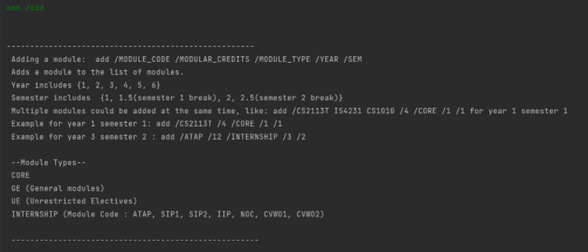

<small>Click <a href="#51-summary-of-features">here</a> to return to the summary of features</small>

<small>Click <a href="#table-of-contents">here</a> to return to the Table of Contents</small>

---

#### 5.5.3 Exiting Modganiser: `bye`
**Function**

When you are done using Modganiser, you can use this command to exit Modganiser.

**Command Format**

`bye`

Example: `bye` exits the program

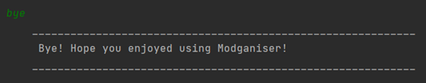

> 📓 [**Note**](#31-special-notations)
>
>Typing bye during any time when the Modganiser is running will exit the program.
When Modganiser asks for your name during its first start up, typing bye will also exit the
program. If your name is “bye”, please do consider using an alias.
Thank you and sorry for the inconvenience caused.

<small>Click <a href="#51-summary-of-features">here</a> to return to the summary of features</small>

<small>Click <a href="#table-of-contents">here</a> to return to the Table of Contents</small>

---

#### 5.5.4 Saving Module Plan

To ensure that your painstakingly created module plan is not lost, Modganiser automatically saves your module plan into your [local storage](#8-glossary) in your device after every command you input.

To find your save file:
1. Go to your Desktop and find the folder titled “Modganiser” or find the folder where tp.jar is saved.
2. Double-click on the folder and find the folder titled “data”
3. Double-click on the folder and the file titled “modules.txt” is the save file

> ❗ [**Warning**](#31-special-notations)
>
> Please do not edit this save file to prevent corrupting your saved data.
> If Modganiser detects a corrupted save file, Modganiser will remove the corrupted save file and create a blank save file (ie. Your entire module plan will be deleted).
> Hence, please do not tamper with the save file if you are not certain that your actions will not corrupt the save file.

Your saved module plan will be automatically loaded when you run Modganiser.

> 📓 [**Note**](#31-special-notations)
>
> If you switch devices and want to import your module plan from your old device to
the new one, firstly locate your save file on the old device, which is just a normal text
file. You can then use any form of messaging applications like [Telegram](https://telegram.org/), email applications
like [Gmail](https://mail.google.com/) or online cloud storage like [Google Drive](https://drive.google.com/) to send this save file to yourself or
store this save file. You can then retrieve this save file from your new device. On your new device, set up Modganiser and locate the save file on your new device. Replace this save file with the one from your old device.

<small>Click <a href="#51-summary-of-features">here</a> to return to the summary of features</small>

<small>Click <a href="#table-of-contents">here</a> to return to the Table of Contents</small>

---

## 6. FAQ

In this section, you will find the most commonly asked questions and answers. If your question is not here, please look at the [Table of Contents](#table-of-contents) to find the relevant section. Thank you!

| Questions                                                                                                                            | Answers                                                                                                                                                                                                                                                                                                                                                                                                                                                                                                                 |
|--------------------------------------------------------------------------------------------------------------------------------------|-------------------------------------------------------------------------------------------------------------------------------------------------------------------------------------------------------------------------------------------------------------------------------------------------------------------------------------------------------------------------------------------------------------------------------------------------------------------------------------------------------------------------|
| I am unable to install Java?                                                                                                         | Please click [here](https://www.oracle.com/sg/java/technologies/downloads/) to install the correct version of java for your device (Windows or MacOS) or contact the developers for help.                                                                                                                                                                                                                                                                                                                               |
| Why is Modganiser not running?                                                                                                       | Please follow our [Set-Up Guide](#4-set-up-guide) closely. If Modganiser still fails to run, please [contact us](https://github.com/AY2223S2-CS2113T-T09-4/tp/issues) by clicking on the green "new issue" button and submitting it.                                                                                                                                                                                                                                                                                    |
| Where is my save file?                                                                                                               | Please go to your desktop and locate the folder titled “Modganiser” or the folder where you stored tp.jar. Inside that folder, you will find another folder titled “data” which has a text file titled “modules”. This text file is the save file which has information on your module plan.                                                                                                                                                                                                                            |
| What if I change my device? How do I transfer the save data to my new device?                                                        | Please refer to Modganiser's [save feature](#554-saving-module-plan) for instructions on how to locate your save file and send it to your new device.                                                                                                                                                                                                                                                                                                                                                                   | 
| Why am I able to add CS0000 even though it is not a valid module? Or input the wrong MCs for the module? Or use a wrong module type? | We are unable to keep a database of modules in our ChatBot and hence cannot check if the module code you inputted is being offered. Please go onto [NUSMods](https://nusmods.com) to check the modules you want to take before carefully inputting the module code and the number of MCs of that module. Furthermore, please double check against the [Information Security Student requirements](https://www.comp.nus.edu.sg/cugresource/per-cohort/isc/isc-21-22/) before deciding on the [module type](#8-glossary). |
| Why does Modganiser quit when I type "bye" instead of saving it as my name?                                                          | `bye` is a command that will quit Modganiser, regardless of where it is used. If your name is “bye”, please consider using an alias. We are very sorry for the inconvenience caused.                                                                                                                                                                                                                                                                                                                                    |

<small>Click <a href="#51-summary-of-features">here</a> to return to the summary of features</small>

<small>Click <a href="#table-of-contents">here</a> to return to the Table of Contents</small>

---

## 7. Command Summary

A summary of Modganiser's various features and their respective command formats

|                   Feature                    | Command Word |                       Command Format                        |                                    Example                                     |
|:--------------------------------------------:|:------------:|:-----------------------------------------------------------:|:------------------------------------------------------------------------------:|
|                 Add modules                  |     `add`      | `add /MODULE_CODE /MODULAR_CREDITS /MODULE_TYPE /YEAR /SEM` |                         `add /CS2113T /4 /CORE /1 /1`                          |
|              Add grade obtained              |    `grade`     |                 `grade /MODULE_CODE /GRADE`                 |                              `grade /CS2113T /A+`                              |
|             Edit module details              |     `edit`     |       `edit /MODULE_CODE /FIELD_TO_EDIT /NEW_INFO  `        |                           `edit /CS2113T /TYPE /UE`                            |
|                Delete module                 |    `delete`    |                    `delete /MODULE_CODE`                    |                               `delete /CS2113T`                                |
|               List module plan               |     `list`     |                        `list /YEAR`                         |                                   `list /2`                                    |
|                 Find module                  |     `find`     |               `find /TYPE_OF_SEARCH /KEYWORD`               |                       `find /CODE /CS or find /TYPE /GE`                       |
| Track progress of [module type](#8-glossary) |    `track`     |                    `track /MODULE_TYPE`                     |                              `track /INTERNSHIP`                               |
|            Calculate current CAP             | `calculatecap` |                       `calculatecap`                        |                                 `calculatecap`                                 |
|                 View Manual                  |     `man`      |                   `man` or `man /FEATURE`                   |                              `man` or `man /add`                               |
|               Exit Modganiser                |     `bye`      |                            `bye`                            |                                     `bye`                                      |

<small>Click <a href="#51-summary-of-features">here</a> to return to the summary of features</small>

<small>Click <a href="#table-of-contents">here</a> to return to the Table of Contents</small>

---

## 8. Glossary

A explanation of the technical terms frequently used in this guide or unique to Modganiser.

| Technical Term          | Explanation                                                                                                                                                                                                                                                                |
|-------------------------|----------------------------------------------------------------------------------------------------------------------------------------------------------------------------------------------------------------------------------------------------------------------------|
| Command Line Interface  | Text based user interface to run programs                                                                                                                                                                                                                                  |
| Parameter               | Additional input fields that require user inputs for the command to work as intended                                                                                                                                                                                       |
| Alphanumeric            | Numbers from 0-9, letters from a-z and A-Z                                                                                                                                                                                                                                 |
| Module Type             | Refers to one of Core, GE, UE, INTERNSHIP or all of them.                                                                                                                                                                                                                  | 
| Core Module Type        | Any module that does not fall under UE, GE or Internship module type                                                                                                                                                                                                       |
| GE Module Type          | Stands for General Elective Module Type. Please refer to the [NUS Website](https://www.nus.edu.sg/registrar/academic-information-policies/undergraduate-students/general-education/for-students-admitted-from-ay2021-22) for more information on General Elective Modules  |
| UE Module Type          | Stands for Unrestricted Elective Module Type. Please refer to the [NUS Website](https://www.nus.edu.sg/registrar/academic-information-policies/undergraduate-students/curriculum-structure) for more information on UE Modules                                             |
| Internship Module Type  | Please refer to the [NUS Website](https://www.comp.nus.edu.sg/industry/intern/student/) for more information on Internships                                                                                                                                                |
| Local storage           | Data that is stored on your device and can be accessed without an internet connection                                                                                                                                                                                      |

<small>Click <a href="#51-summary-of-features">here</a> to return to the summary of features</small>

<small>Click <a href="#table-of-contents">here</a> to return to the Table of Contents</small>

---

