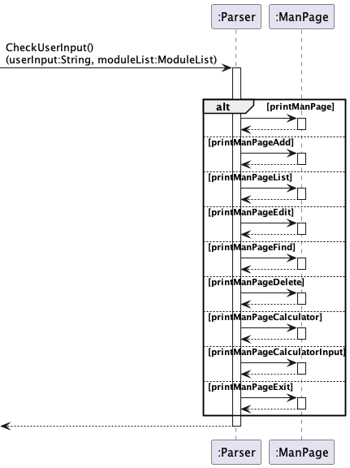
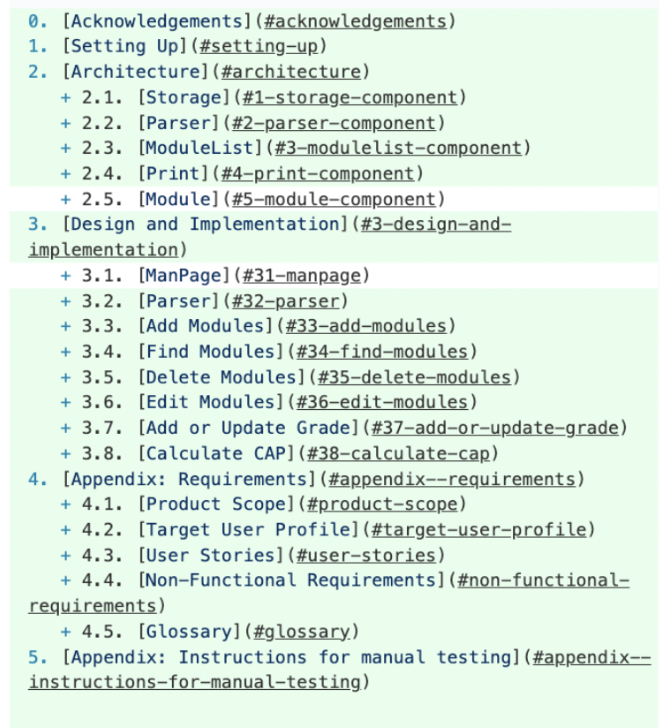
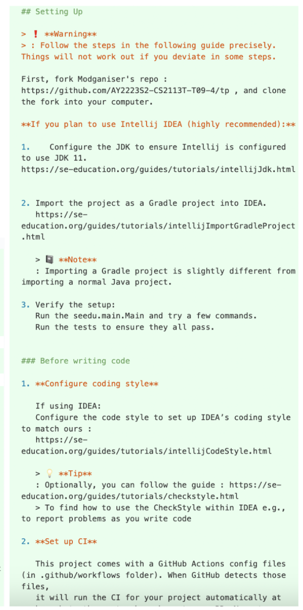
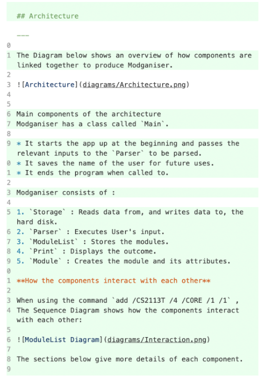
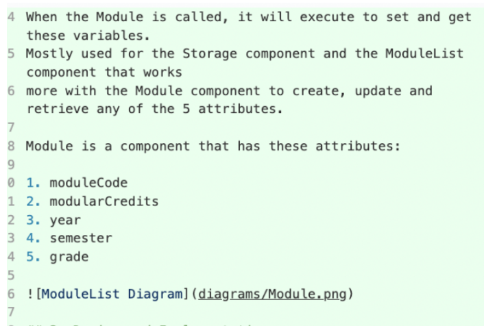
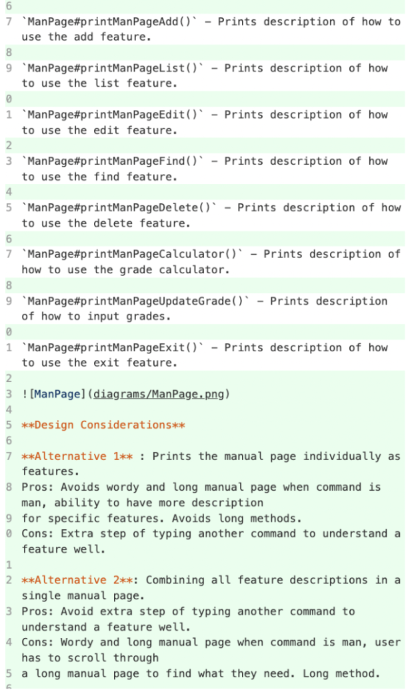
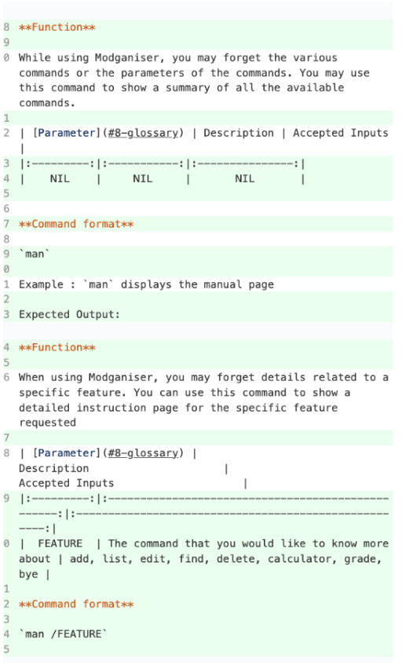
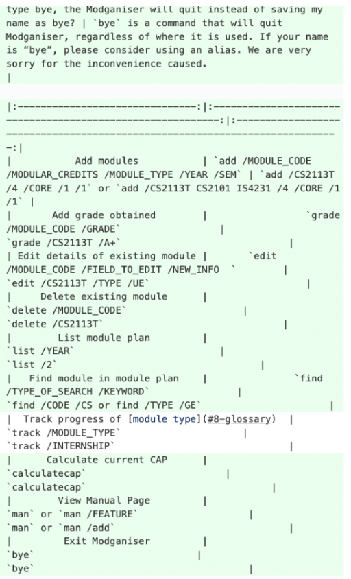

# Anthea Yip's Project Portfolio Page (PPP)

### Overview

Modganiser is effortless module planning, at your fingertips via the 
Command Line Interface (CLI), focused on helping Information Security 
Undergraduates graduate in 4 years. It does so by giving you a platform
to plan all 4 years of your modules to ensure that you meet the graduation
requirements (Core/UE/GE/Internships).

### Summary of Contributions 

1. **Code contributed:**

   [Code DashBoard](https://nus-cs2113-ay2223s2.github.io/tp-dashboard/?search=anthea-pr0g&breakdown=true&sort=groupTitle&sortWithin=title&since=2023-02-17&timeframe=commit&mergegroup=&groupSelect=groupByRepos&checkedFileTypes=docs~functional-code~test-code~other&tabOpen=true&tabType=authorship&tabAuthor=anthea-pr0g&tabRepo=AY2223S2-CS2113T-T09-4%2Ftp%5Bmaster%5D&authorshipIsMergeGroup=false&authorshipFileTypes=docs~functional-code~test-code~other&authorshipIsBinaryFileTypeChecked=false&authorshipIsIgnoredFilesChecked=false)
   
   [Pull Requests](https://github.com/AY2223S2-CS2113T-T09-4/tp/pulls?q=is%3Apr+author%3Aanthea-pr0g)
    

2. **Enhancements implemented:**

   * ManPage class - constantly needing to update it as the features change
   and split the features up so the manpage is easier to look at
   * Method in Parser to check User Input before it uses its respective
   ManPage methods
   * A new type of module that handles Internships such as ATAP and SIP
   * Exceptions for ManPage Inputs
   * Exceptions to accept only 0-6 ,8 ,12 mcs
   * Exceptions to handle duplicate names but different module types
   * Bye command
   * JavaDoc

3. **Contributions to the UG:**

   * Manpage feature description/ command usage
   * Command summary table

4. **Contributions to the DG:** 

   * Table of contents with the hyperlinks
   * Setting up section
   * Architecture components and how they interact
   * Module component
   * Manpage component implementation

5. **UML Diagrams I added:**
   * Module component interface diagram 
   * Architecture component sequence diagram 
   * Manpage class sequence diagram

6. **Contributions to team-based tasks**
   * Logging
   * Assertions 
   * Junits
   * Released v1.0 jar in week 9
   * Issues tagged to versions 

7. **Review/mentoring contributions:**
   
   Links to PRs reviewed, instances of helping team members in other ways.
   [#233](https://github.com/AY2223S2-CS2113T-T09-4/tp/pull/233)
   [#167](https://github.com/AY2223S2-CS2113T-T09-4/tp/pull/167)
8. **Contributions beyond the project team:**

   Evidence of helping others e.g. responses you posted in our forum, bugs you reported in other team's products,
   Evidence of technical leadership e.g. sharing useful information in the forum
   Keep in mind that evaluators will use the PPP to estimate your project effort. We recommend that you mention things that will earn you a fair score e.g., explain how deep the enhancement is, why it is complete, how hard it was to implement etc.
   Had to learn how to use Plant UML for sequence and architecture diagrams

### DG extracts

**UML Diagrams I added:**

Interaction Diagram in the Architecture component:

Module Component:

ManPage Implementation:

**DG extract 1:**
Table of contents with hyperlinks

**DG extract 2:**
Added some Tips and Warnings for setting up component

**DG extract 3:**
Explained how the components interact with each other
in the modganiser’s architecture

**DG extract 4:**
Explained what the Module component consisted of  

**DG extract 5:**
Description of ManPage's design and implementation

### UG extracts

**UG extract 1:**
Table of contents with hyperlinks

**UG extract 2:**
Added some Tips and Warnings for setting up component

