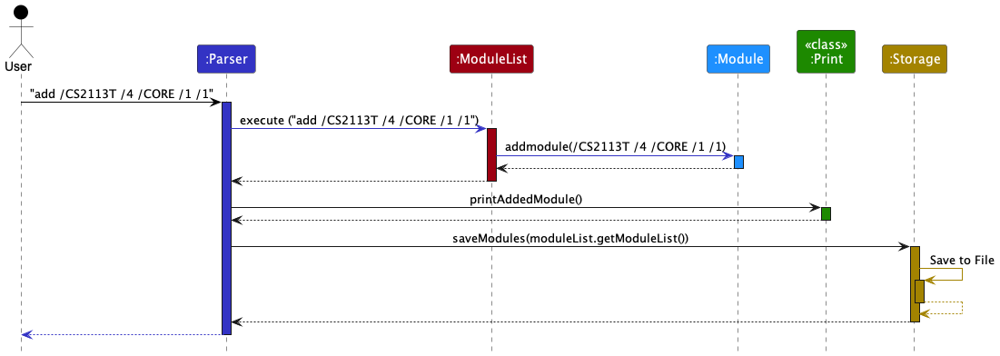
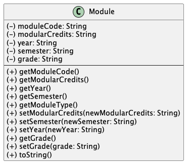

# Anthea Yip's Project Portfolio Page (PPP)

### Overview

Modganiser is effortless module planning, at your fingertips via the 
Command Line Interface (CLI), focused on helping Information Security 
Undergraduates graduate in 4 years. It does so by giving you a platform
to plan all 4 years of your modules to ensure that you meet the graduation
requirements (Core/UE/GE/Internships).

### Summary of Contributions 

1. **Code contributed:**

   [Code DashBoard](https://nus-cs2113-ay2223s2.github.io/tp-dashboard/?search=anthea-pr0g&breakdown=true&sort=groupTitle&sortWithin=title&since=2023-02-17&timeframe=commit&mergegroup=&groupSelect=groupByRepos&checkedFileTypes=docs~functional-code~test-code~other&tabOpen=true&tabType=authorship&tabAuthor=anthea-pr0g&tabRepo=AY2223S2-CS2113T-T09-4%2Ftp%5Bmaster%5D&authorshipIsMergeGroup=false&authorshipFileTypes=docs~functional-code~test-code~other&authorshipIsBinaryFileTypeChecked=false&authorshipIsIgnoredFilesChecked=false)
   
   [Pull Requests](https://github.com/AY2223S2-CS2113T-T09-4/tp/pulls?q=is%3Apr+author%3Aanthea-pr0g)
    

2. **Enhancements implemented:**

   * [ManPage class](https://github.com/AY2223S2-CS2113T-T09-4/tp/pull/69)
   constantly needing to update it as the features change
   and split the features up so the manpage is easier to look at 
   * Method in InputChecker (checkManPageInput()) to check User's Input is valid
     for the manpage command before it uses its respective ManPage methods
   * Method in Command (manPageCommand()) to ensure the appropriate number of fields are used
     and a valid user input is used
   * A new type of module that handles [Internships](https://github.com/AY2223S2-CS2113T-T09-4/tp/pull/69) 
   such as ATAP and SIP 
   * Exceptions for ManPage Inputs 
   * Exceptions to accept only 0-6 ,8 ,12 mcs
   * Exceptions to handle [duplicate names](https://github.com/AY2223S2-CS2113T-T09-4/tp/pull/71)
   but different module types
   * [Bye command](https://github.com/AY2223S2-CS2113T-T09-4/tp/pull/65)
   * [JavaDoc](https://github.com/AY2223S2-CS2113T-T09-4/tp/pull/122)
   * [PE-D bugs](https://github.com/AY2223S2-CS2113T-T09-4/tp/pull/242)
   * [ManPage Bugs found after PE-D](https://github.com/AY2223S2-CS2113T-T09-4/tp/pull/293)
   

3. **Contributions to the UG:**

   * [Manpage feature](https://github.com/AY2223S2-CS2113T-T09-4/tp/pull/149/files) 
   description/ command usage
   * [First Draft of the whole UG including the Command summary table](https://github.com/AY2223S2-CS2113T-T09-4/tp/pull/122)

4. **Contributions to the DG:** 

   * [Table of contents with the hyperlinks](https://github.com/AY2223S2-CS2113T-T09-4/tp/pull/169)
   * [Setting up section](https://github.com/AY2223S2-CS2113T-T09-4/tp/pull/230)
   * [Architecture components](https://github.com/AY2223S2-CS2113T-T09-4/tp/pull/230) and how they interact
   * [Module component](https://github.com/AY2223S2-CS2113T-T09-4/tp/pull/230)
   * [Manpage component implementation](https://github.com/AY2223S2-CS2113T-T09-4/tp/pull/92)

5. **UML Diagrams I added:**

   * Module class diagram 
   * Architecture component sequence diagram

6. **Contributions to team-based tasks**

   * [Logging](https://github.com/AY2223S2-CS2113T-T09-4/tp/pull/61)
   * [Assertions](https://github.com/AY2223S2-CS2113T-T09-4/tp/pull/48)
   * [Junits](https://github.com/AY2223S2-CS2113T-T09-4/tp/pull/42)
   * Released v1.0 jar in week 9
   * Ensure issues are created/delegated when needed

7. **Review/mentoring contributions:**
   
   * Links to PRs reviewed: [#233](https://github.com/AY2223S2-CS2113T-T09-4/tp/pull/233) [#167](https://github.com/AY2223S2-CS2113T-T09-4/tp/pull/167) [#266](https://github.com/AY2223S2-CS2113T-T09-4/tp/pull/266) [#277](https://github.com/AY2223S2-CS2113T-T09-4/tp/pull/277)
   * Added the return to Table of contents link for everyone's component in the DG 
   * Cleaned up inconsistencies as I see them
   

8. **Contributions beyond the project team:**

   * Peer reviewed User guides and Developer guides for team [rainyDay](https://github.com/AY2223S2-CS2113T-T09-1/tp)
     and team [MoneyGoWhere](https://github.com/AY2223S2-CS2113T-T09-2/tp).
   * Reported 21 Bugs for Practical Dry Run.
   * Learnt Plant UML for sequence, class and architecture diagrams.
   * It was hard to keep track of changes made to each feature by other members
     and to make these changes also to the manual page.
   
### **UML Diagrams I added:**

Interaction Diagram in the Architecture component:

Module Class:

