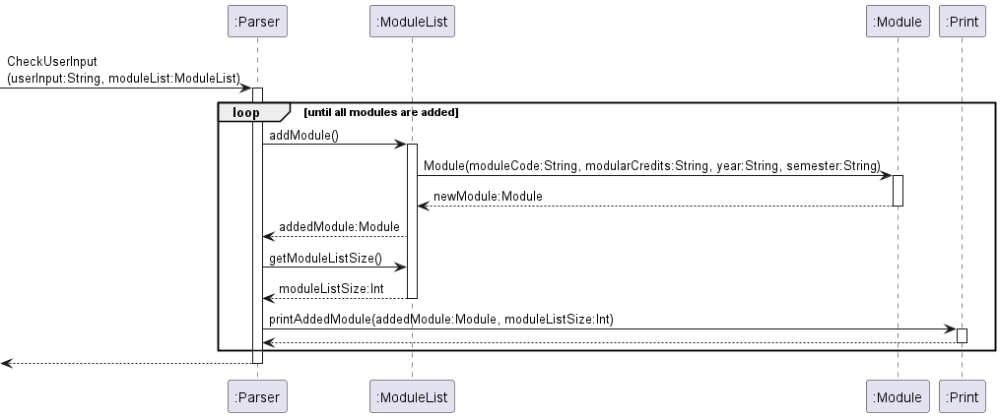

# Gerald Koh Kheng Guan - Project Portfolio Page

## Project: Modganiser

Modganiser is effortless module planning at your fingertips via the Command Line Interface (CLI), focused on helping
Information Security Undergraduates graduate in 4 years. It provides a platform to plan all 4 years of your modules
to ensure that you meet your graduation requirements.
Built on Java, Modganiser can definitely get your module plan up faster than traditional Graphical User Interface (GUI)
apps if you can type fast.

## Summary of contributions

### Code Contributed
* Please click on this [link to my RepoSense report](https://nus-cs2113-ay2223s2.github.io/tp-dashboard/?search=geraldkoh4&sort=groupTitle&sortWithin=title&timeframe=commit&mergegroup=&groupSelect=groupByRepos&breakdown=true&checkedFileTypes=docs~functional-code~test-code~other&since=2023-02-17&tabOpen=true&tabType=authorship&zFR=false&tabAuthor=geraldkoh4&tabRepo=AY2223S2-CS2113T-T09-4%2Ftp%5Bmaster%5D&authorshipIsMergeGroup=false&authorshipFileTypes=docs~functional-code~test-code&authorshipIsBinaryFileTypeChecked=false&authorshipIsIgnoredFilesChecked=false) to view my contributions.

* Please click on this [link to my Pull Requests](https://github.com/AY2223S2-CS2113T-T09-4/tp/pulls?q=is%3Apr+is%3Aclosed+author%3Ageraldkoh4) to view my pull requests.

### Enhancements Implemented

* Set-up the team repo and invited everyone
* Created and maintained the add module command.
* Implemented the Exception class
* Created and maintained some printing methods such as add command error print messages
* Exceptions to the add module command and its different fields
* Logging for the add module command
* Junit testing for the add module command
* JavaDoc
* For more information please refer to the [link to my Pull Requests.](https://github.com/AY2223S2-CS2113T-T09-4/tp/pulls?q=is%3Apr+is%3Aclosed+author%3Ageraldkoh4)

### Contributions to the User Guide
* [Add Command](https://github.com/AY2223S2-CS2113T-T09-4/tp/blob/master/docs/UserGuide.md#521-adding-modules-add)
    * Created a draft of the add command for UG
    * See [PR#167](https://github.com/AY2223S2-CS2113T-T09-4/tp/pull/167)

### Contributions to the Developer Guide
* [Architecture Component](https://github.com/AY2223S2-CS2113T-T09-4/tp/blob/master/docs/DeveloperGuide.md#architecture)
  * Created the first draft of the Architecture component for the DG
    * The following is the UML diagram I added. It is a component diagram to illustrate how the `ModuleList` component works.
    
        * See [PR#181](https://github.com/AY2223S2-CS2113T-T09-4/tp/pull/181)
* [Add Command](https://github.com/AY2223S2-CS2113T-T09-4/tp/blob/master/docs/DeveloperGuide.md#33-add-modules)
  * Created the first draft of the add command for the DG
    * The following is the UML diagram I added. It is a sequence diagram to illustrate how the `Add` command works. 
    
      * See [PR#182](https://github.com/AY2223S2-CS2113T-T09-4/tp/pull/182)

### Reviewing/Mentoring contributions
* Pull Requests reviewed : [link](https://github.com/AY2223S2-CS2113T-T09-4/tp/pulls?q=is%3Apr+is%3Aclosed+reviewed-by%3A%40me)

### Contributions beyond the project team
* Reported [bugs](https://github.com/geraldkoh4/ped/issues) for the product [SEP Helper](https://github.com/AY2223S2-CS2113-T12-3/tp)
* Reviewed the User Guides and Developer Guides of other teams in my tutorial group.