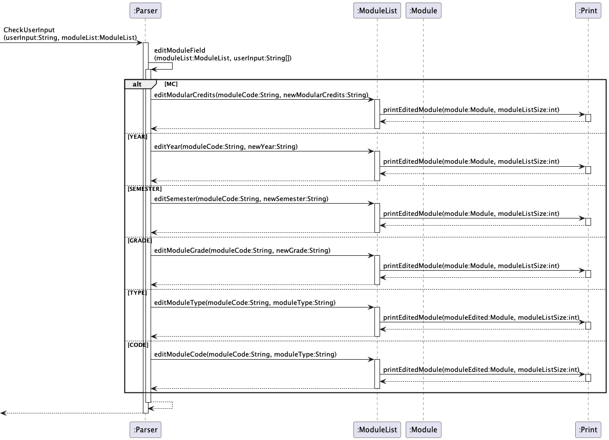
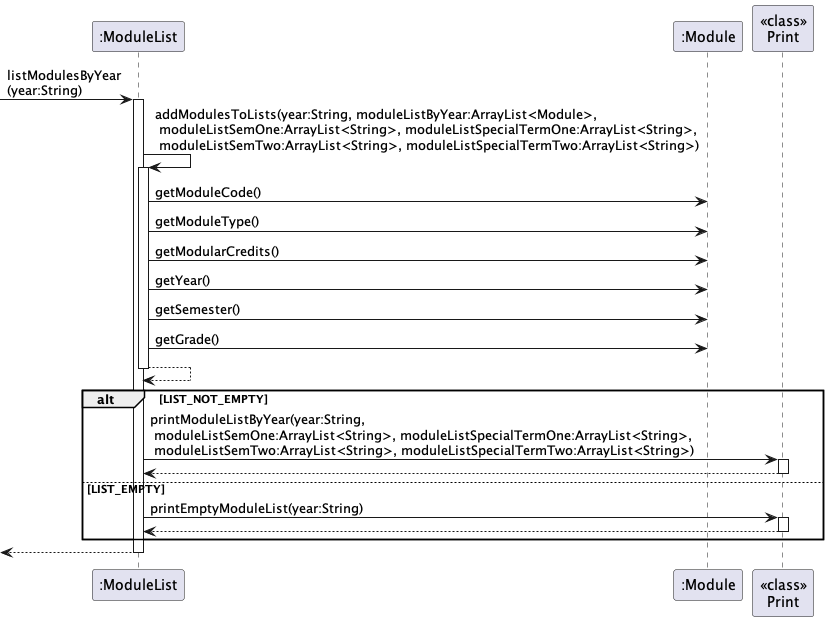

# Saint - Project Portfolio Page

## Project: Modganiser

Modganiser is a module planner that is focused on helping Information Security Undergraduates graduate in 4 years. 
It does so by giving them a platform to plan all 4 years of their modules to aid in meeting their graduation 
requirements on time. Modganiser works via the Command Line Interface (CLI), which is much more efficient for fast 
typists.

The following sections include the contributions that I have made to the project.

#### Code Contributed
Please refer to the following links to view my contributions:
* [Code Dashboard](https://nus-cs2113-ay2223s2.github.io/tp-dashboard/?search=saintzaw&sort=groupTitle&sortWithin=title&timeframe=commit&mergegroup=&groupSelect=groupByRepos&breakdown=true&checkedFileTypes=docs~functional-code~test-code~other&since=2023-02-17)
* [Pull Requests](https://github.com/AY2223S2-CS2113T-T09-4/tp/pulls?q=is%3Apr+author%3Asaintzaw)

#### Enhancements Implemented
* `list` command 
    * Please refer to [lines 176-261](https://github.com/AY2223S2-CS2113T-T09-4/tp/blob/master/src/main/java/seedu/main/ModuleList.java) and **PR** [#33](https://github.com/AY2223S2-CS2113T-T09-4/tp/pull/33/commits), [#133](https://github.com/AY2223S2-CS2113T-T09-4/tp/pull/133)
    * Implemented a command to `list` the modules in the user's module plan.
    * In v1.0, implemented the function to list all the modules in the user's module plan.
    * In v2.0, enhanced the function to list modules based on the year that they are planned for.

* `edit` command 
    * Please refer to [lines 263-312](https://github.com/AY2223S2-CS2113T-T09-4/tp/blob/master/src/main/java/seedu/main/ModuleList.java) and **PR** [#75](https://github.com/AY2223S2-CS2113T-T09-4/tp/pull/75)
    * Implemented a command to `edit` various fields in a module's description.
    * In v2.0, implemented the function to edit the Module Type, Modular Credits, Year and Semester fields in a module's description.
    * In v2.1, enhanced the function by adding more input validity checks to [fix PE-D functionality bugs](https://github.com/AY2223S2-CS2113T-T09-4/tp/pull/238). 

* `track` command
    * Did the initial implementation of the `track` command for tracking the graduation requirements for UE, GE and INTERNSHIP-type modules. 
    * Please refer to **PR** [#119](https://github.com/AY2223S2-CS2113T-T09-4/tp/pull/119) and [#120](https://github.com/AY2223S2-CS2113T-T09-4/tp/pull/120) to see my contributions.
  
* Added JUnit Tests, Assertions and Logging
    * Added JUnit tests to `Print` tests for `edit` and `list` commands. Please refer to [PR #96](https://github.com/AY2223S2-CS2113T-T09-4/tp/pull/96)
    * Added assertions for `delete` command. Please refer to [PR #50](https://github.com/AY2223S2-CS2113T-T09-4/tp/pull/50)
    * Added logging to `list` and `edit` commands. Please refer to [PR #306](https://github.com/AY2223S2-CS2113T-T09-4/tp/pull/306)

#### Contributions to the User Guide
* [Edit Command](https://github.com/AY2223S2-CS2113T-T09-4/tp/blob/master/docs/UserGuide.md#523-editing-module-details-edit)
    * Created a draft of the edit command for UG
    * Please refer to [PR #164](https://github.com/AY2223S2-CS2113T-T09-4/tp/pull/164)
* [List Command](https://github.com/AY2223S2-CS2113T-T09-4/tp/blob/master/docs/UserGuide.md#531-viewing-module-plan-list)
    * Created a draft of the list command for UG
    * Please refer to [PR #164](https://github.com/AY2223S2-CS2113T-T09-4/tp/pull/164)

#### Contributions to the Developer Guide
* [Parser Component](https://github.com/AY2223S2-CS2113T-T09-4/tp/blob/master/docs/DeveloperGuide.md#2-parser-component)
    * Added descriptions and a UML diagram of the Parser for the DG
    * Please refer to **PR** [#235](https://github.com/AY2223S2-CS2113T-T09-4/tp/pull/235)
* [Edit Command](https://github.com/AY2223S2-CS2113T-T09-4/tp/blob/master/docs/DeveloperGuide.md#edit-modules)
    * Added descriptions and a UML diagram of the edit command for the DG
    * Please refer to **PR** [#104](https://github.com/AY2223S2-CS2113T-T09-4/tp/pull/104)
* [List Command](https://ay2223s2-cs2113t-t09-4.github.io/tp/DeveloperGuide.html#list-modules)
    * Added descriptions and a UML diagram of the list command for the DG
    * Please refer to **PR** [#302](https://github.com/AY2223S2-CS2113T-T09-4/tp/pull/302) and [#306](https://github.com/AY2223S2-CS2113T-T09-4/tp/pull/306)  
* [Track Command](https://ay2223s2-cs2113t-t09-4.github.io/tp/DeveloperGuide.html#47-track-modules)
    * Added descriptions of the track command for the DG
    * Please refer to **PR** [#313](https://github.com/AY2223S2-CS2113T-T09-4/tp/pull/313)
* Added a section on [Documentation, Logging and Testing](https://ay2223s2-cs2113t-t09-4.github.io/tp/DeveloperGuide.html#documentation-logging-and-testing)

#### Reviewing/Mentoring contributions
* Reviewed my team members' PRs. Please refer to **PR**: [#273](https://github.com/AY2223S2-CS2113T-T09-4/tp/pull/273) 
, [#181](https://github.com/AY2223S2-CS2113T-T09-4/tp/pull/181) , [#275](https://github.com/AY2223S2-CS2113T-T09-4/tp/pull/275)
, [#263](https://github.com/AY2223S2-CS2113T-T09-4/tp/pull/263) , [#278](https://github.com/AY2223S2-CS2113T-T09-4/tp/pull/278)

#### Contributions beyond the project team
* Reported [PE-D bugs](https://github.com/saintzaw/ped/issues) for team [EveNtUS](https://github.com/AY2223S2-CS2113-W12-2/tp)
* Reviewed User Guides and Developer Guides of other teams in my tutorial group.

### Extract: Developer Guide

#### Component diagram for `Parser` component

#### Sequence diagram for `edit` command

#### Sequence diagram for `listModulesByYear()` 
